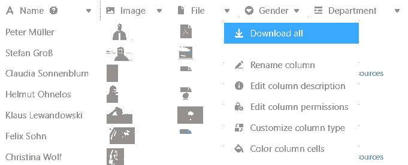

Numa **coluna de ficheiros** pode guardar um ou mais ficheiros e assim adicionar documentos à respectiva linha.

## Como criar uma coluna de ficheiro

1. Clique no **símbolo \[+\]** à direita da última coluna da sua tabela.
2. Dê um **nome** à coluna no campo superior.
3. Seleccione o tipo de coluna **Arquivo** no menu pendente.

## Carregar novos ficheiros

Pode **carregar ficheiros** na coluna de ficheiros clicando numa **célula** com o rato e seleccionando o **símbolo de mais** que aparece. Pode arrastar **e largar** ficheiros para a nova janela aberta ou clicar com o rato para carregar ficheiros a partir do seu dispositivo.



### Carregar vários ficheiros novos ao mesmo tempo

1. Clique na **célula de** uma coluna de ficheiro.
2. Clique no **símbolo de mais** que aparece.
3. Abre-se uma nova janela. Aqui pode carregar ficheiros a partir do seu dispositivo por **arrastar e largar** ou **clicar**.
4. Seleccione vários ficheiros ao mesmo tempo, seleccionando todos os documentos que deseja carregar e carregando-os em conjunto.



Os ficheiros que carrega localmente para uma coluna de ficheiros são guardados numa **pasta do sistema** a que pode aceder através da [gestão de ficheiros]() da sua Base.



## Adicionar ficheiros existentes

Para além dos novos ficheiros que carrega localmente para a célula de uma coluna de ficheiros, também pode adicionar ficheiros existentes, que podem ser provenientes de **três fontes**:

- **Últimos carreg**amentos: Aqui encontrará os ficheiros carregados mais recentemente que estão guardados no [gestor de ficheiros]() Base.
- **As minhas pastas**: Aqui tem acesso aos ficheiros das suas próprias pastas, que pode criar e preencher no [gestor de ficheiros]().
- **Seafile**: Aqui pode selecionar ficheiros das [bibliotecas Seafile]() que estão ligadas à sua base.

1. Clique na **célula de** uma coluna de ficheiros e, em seguida, no **símbolo de mais** que aparece.
2. Abre-se uma nova janela. Na navegação à esquerda, seleccione a **fonte** a partir da qual pretende adicionar um ficheiro.
3. Clique na **estrutura de pastas para** aceder ao ficheiro pretendido.
4. Seleccione o **ficheiro** e insira-o na célula com **Enviar**.

## Descarregamento de ficheiros

1. Na coluna do ficheiro, **faça duplo clique** sobre a célula que contém os documentos que pretende descarregar.
2. Abre-se uma nova janela. **Todos os ficheiros** que estão armazenados na célula são listados aqui.
3. Desta forma, pode criar um **ficheiro único** download:
    - Mova o ponteiro do rato sobre o documento e clique no **ícone de download** .
4. Para que possa **ficheiros múltiplos** download:
    - Clique **Seleccionar**.
    - Seleccionar a opção **Seleccionar tudo** ou colocar **marcas** nas caixas em frente dos ficheiros.
    - Depois clique em **Download**.

Se pretender descarregar todos os ficheiros de uma coluna, abra o menu pendente acima do cabeçalho da coluna e seleccione **Descarregar tudo**.

Pode então especificar **o seu próprio nome de ficheiro** e será apresentado o **número de ficheiros** contidos na exportação.

Se clicar nos **três pontos**, tem duas opções para guardar o ficheiro: Ao **descarregar**, é guardado um ficheiro zip no seu dispositivo, do qual pode extrair todos os ficheiros. Também pode guardar os ficheiros **no Seafile**. Para o fazer, tem de [ligar primeiro uma biblioteca Seafile à sua Base]().

## Mudar o nome dos ficheiros

1. Abrir a janela **Todos os ficheiros** **fazendo duplo clique sobre** uma célula na coluna Ficheiro.
2. Mova o ponteiro do rato sobre o ficheiro que pretende renomear e clique nos **três pontos**.
3. Seleccione a opção **Renomear** e introduza um novo **nome de ficheiro**.

## Eliminar ficheiros

1. Abrir a janela **Todos os ficheiros** **fazendo duplo clique sobre** uma célula na coluna Ficheiro.
2. Desta forma, pode criar um **ficheiro único** Eliminar
    - Mova o ponteiro do rato sobre o ficheiro que pretende apagar e clique nos **três pontos**.
    - Seleccionar a opção **Eliminar**.
3. Para que possa **ficheiros múltiplos** Eliminar
    - Clique **Seleccionar**.
    - Seleccionar a opção **Seleccionar tudo** ou colocar **marcas** nas caixas em frente dos ficheiros.
    - Clique em **Eliminar.**



Os ficheiros **não** são apagados permanentemente desta forma. Só quando os ficheiros são apagados no [gestor de ficheiros]() Base é que são permanentemente [removidos]().



## Perguntas mais frequentes

Sim. Mesmo que um utilizador só tenha **permissão de leitura**, pode descarregar ficheiros.

Não. Para poder reproduzir **ficheiros áudio**, deve primeiro descarregá-los.

Não, a ordem **não pode** ser alterada dentro de uma coluna de ficheiro. O documento carregado primeiro vem em primeiro lugar. Pela ordem em que se carregam os documentos, pode-se determinar a ordem dentro da coluna do ficheiro.


