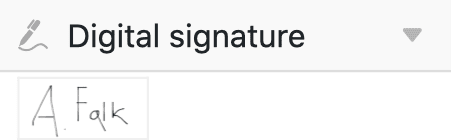
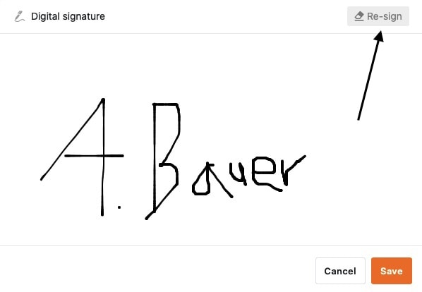
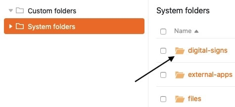
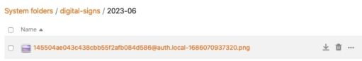

You can store a digital signature in a **signature column**, which is saved as a PNG file in the Base file manager.

## How to create a signature column

1. Click the **\[+\] symbol** to the right of the last column in your table.
2. Give the column a **name** in the upper field.
3. Select the **Signature** column type from the drop-down menu.

## Capture a digital signature

Clicking in any cell of the **signature column** automatically opens a window with a **panel** where you can sign with your mouse and - on devices with a touchscreen - with a pen or finger.



Digital signatures are very well suited for data capture using [web forms](), for example, to have applications conveniently signed online.



## Secure a digital signature

To save a signature entered in the panel, simply click **Save**. The signature entered in the panel is then saved in the cell and can be called up at any time by double-clicking.

## Change a digital signature

If you are not satisfied with your deposited signature and want to sign again, simply click on **Sign again**. Note that this will overwrite the entire signature you entered. It is **not** possible to change individual parts of your signature.



However, the original signature remains available in the Base [file manager]() as a PNG file if you have already saved it.



## Digital signatures in the file manager

Each stored signature is also saved in the [file management]() of your Base as a PNG file in a **system folder**.

From there you can both **download** and **delete** your signatures.

