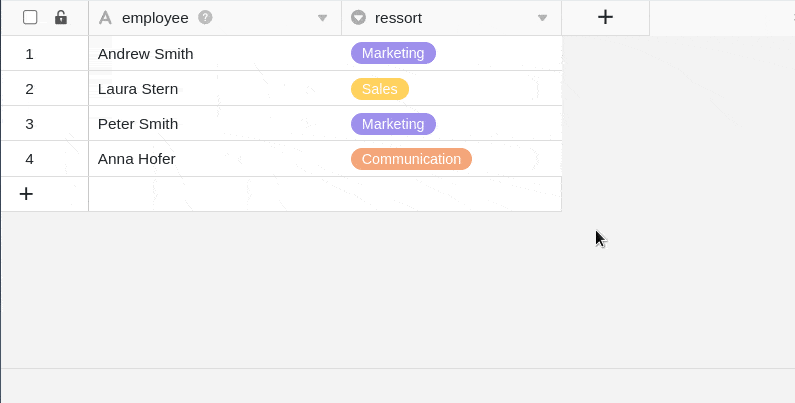
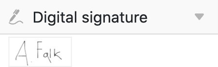
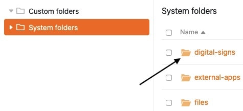
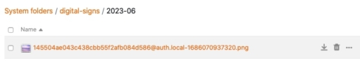

Цифровую подпись можно хранить в **столбце подписи**, который сохраняется в виде PNG-файла в файловом менеджере Base.

## Как создать колонку подписи

1. Нажмите на **символ \[+\]** справа от последнего столбца вашей таблицы.
2. Дайте столбцу **имя** в верхнем поле.
3. Выберите тип столбца **Signature** Column в раскрывающемся меню.

## Получение цифровой подписи

Если вы щелкните в любой ячейке **столбца подписи**, автоматически откроется окно с **панелью**, в которой вы можете поставить подпись с помощью мыши и - на устройствах с сенсорным экраном - с помощью пера или пальца.



Цифровые подписи очень хорошо подходят для сбора данных с помощью [веб-форм](), например, для удобного подписания заявлений в режиме онлайн.



## Защита цифровой подписи

Чтобы сохранить подпись, введенную на панели, просто нажмите кнопку **Сохранить**. Подпись, введенная на панели, сохраняется в ячейке и может быть вызвана в любое время двойным щелчком мыши.

## Изменение цифровой подписи

Если вы не удовлетворены своей подписью и хотите подписаться еще раз, просто нажмите на кнопку **Подписать еще раз**. Обратите внимание, что вся подпись, которую вы ввели, будет перезаписана. **Невозможно** изменить отдельные части подписи.



## Цифровые подписи в файловом менеджере

Каждая сохраненная подпись также сохраняется в [файловом управлении](https://seatable.io/ru/docs/dateien-und-bilder/das-dateimanagement-einer-base/) вашей базы в виде PNG-файла в **системной папке**.

Отсюда вы можете как **загрузить**, так и **удалить** свои подписи.

