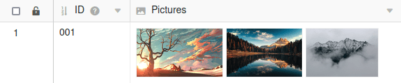

Estão disponíveis dois tipos de colunas com o mesmo nome no SeaTable para registar **ficheiros** e **imagens**. A [coluna de imagens]() é uma [coluna de ficheiros]() restrita, uma vez que apenas aceita formatos especiais de ficheiros de imagens. Esta restrição pode ser muito prática em determinadas aplicações.

## Coluna de imagem

O tipo de coluna **Imagem** armazena qualquer número de **ficheiros** de imagem nos formatos de ficheiro **BMP, GIF, ICO, JPG, PNG, SVG e TIF**. A coluna Imagem é, portanto, uma coluna de ficheiros limitada a formatos de ficheiros de imagem e oferece uma **pré-visualização** sob a forma de uma imagem em miniatura.

## Coluna de arquivo

O tipo de coluna **Arquivo** armazena qualquer número de arquivos de **qualquer tipo de arquivo**. Funções adicionais tais como **renomear**, **apagar** e **descarregar**, bem como a **edição on-line de documentos do Office** facilitam o trabalho com os ficheiros introduzidos.

## Restrições actuais

- A **pesquisa** do SeaTable não pode pesquisar nomes de ficheiros.
- Actualmente **não é possível** utilizar colunas de ficheiros e de imagens em fórmulas.
