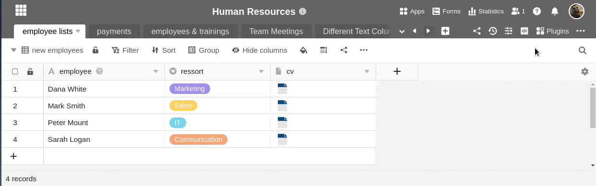
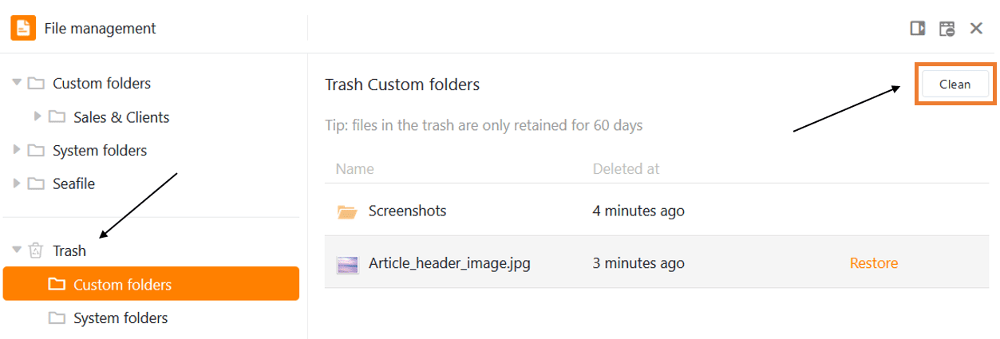

**Los** archivos, **imágenes** y **firmas** que **elimine** en una tabla pueden seguir encontrándose en el gestor de [archivos]() de la Base. Para eliminarlos de forma permanente, también debes borrar los archivos del gestor de archivos.

## Eliminar archivos del gestor de archivos

1. Haz clic en los **tres puntos** de la cabecera de la base y abre la **gestión de archivos**.
2. Vaya a la **carpeta** correspondiente en la que desea eliminar el archivo.
3. Mueva el ratón sobre el **archivo** que desea eliminar y haga clic en el **icono de la papelera de reciclaje**.
4. Confirme de nuevo con **Suprimir.**

## Eliminación definitiva de archivos

En cuanto hayas borrado los archivos deseados, irán a parar a la **papelera de reciclaje** del gestor de archivos. Permanecen allí durante **60 días** y pueden ser restaurados. Si desea eliminar definitivamente los archivos del sistema antes de que expire este plazo, puede **vaciar** la papelera de reciclaje.

1. Haga clic en **Papelera de reciclaje** en la navegación.
2. Seleccione **Mis carpetas** o **Carpetas del sistema**, dependiendo de dónde se encuentren los archivos que desea eliminar de forma permanente.
3. Haga clic en **Vacío**.


