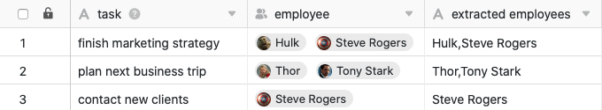

Mithilfe der Datenverarbeitungsfunktion können Sie diverse Operationen über eine Spalte hinweg durchführen. Die **Übertragung von Benutzernamen** stellt dabei eine Operation dar, bei der Daten aus Spalten vom Typ [Mitarbeiter](), [Ersteller](die-spalten-letzter-bearbeiter-und-zuletzt-bearbeitet/) in eine [Text-Spalte](https://seatable.io/docs/text-und-zahlen/die-spalten-text-und-formatierter-text/) kopiert werden können.

## Anlegen der Operation

1. Öffnen Sie eine beliebige **Tabelle** und klicken Sie auf die **drei Punkte** in den Ansichtsoptionen.
2. Klicken Sie auf **Datenverarbeitung** und im Anschluss auf **Datenverarbeitungsoperation hinzufügen**.
3. Geben Sie der Operation einen **Namen** und wählen Sie **Benutzernamen übertragen** aus.
   5. Definieren Sie **Tabelle**, **Ansicht**, **Quellspalte** und **Ergebnisspalte**.
   7. Klicken Sie auf **Speichern**, um die Aktion zu speichern und später auszuführen, oder auf **Ausführen**, um die Aktion direkt auszuführen.
   Bei der ersten erfolgreichen Ausführung erscheint am unteren linken Rand ein kleiner **grüner Haken**. 

## Ausführung der Operation

Wenn Sie beispielsweise eine Tabelle mit zu erledigenden Aufgaben pflegen, in der Ihre **Teammitglieder** als zuständige Ansprechpersonen in einer [Mitarbeiter-Spalte]() erfasst sind, können Sie die Benutzernamen einfach in eine [Text-Spalte](https://seatable.io/docs/text-und-zahlen/die-spalten-text-und-formatierter-text/) kopieren, z. B. um diese für eine Mitarbeiterliste zu verwenden.

Befolgen Sie dazu die oben beschriebenen Schritte und wählen Sie die Mitarbeiter-Spalte als **Quellspalte** sowie die Text-Spalte als **Ergebnisspalte** aus.

Bei erfolgreicher Ausführung der Operation werden die **ausgewählten Benutzernamen** aus der Mitarbeiter-Spalte extrahiert und durch ein Komma getrennt in die Text-Spalte übertragen.


