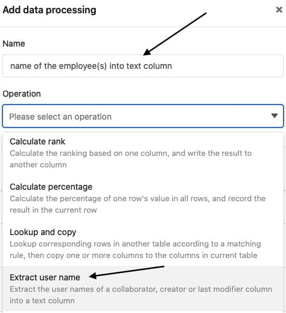
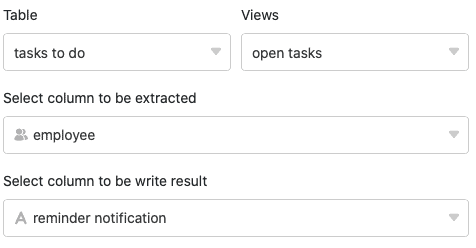
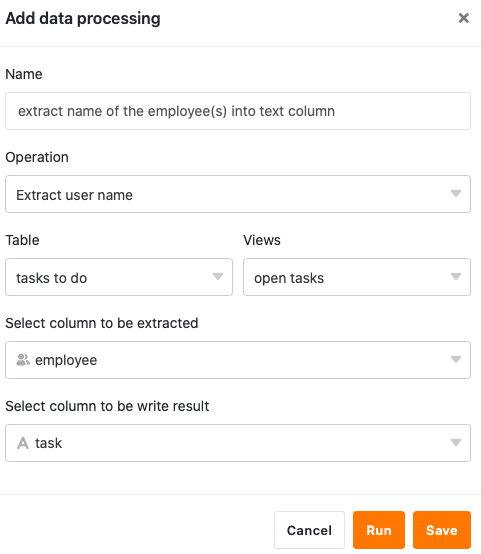
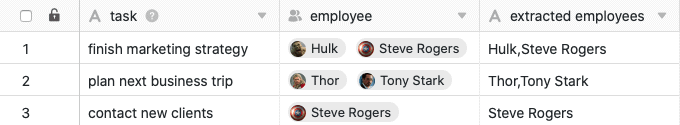

Using the data processing function, you can perform various operations across a column. The **transfer of user names** is an operation that copies data from columns of the type [Employee](https://seatable.io/en/docs/datum-dauer-und-personen/die-spalte-mitarbeiter/), [Creator](https://seatable.io/en/docs/datum-dauer-und-personen/die-spalten-ersteller-und-erstellt/) or [Last editor](https://seatable.io/en/docs/datum-dauer-und-personen/die-spalten-letzter-bearbeiter-und-zuletzt-bearbeitet/) into a [text column](https://seatable.io/en/docs/text-und-zahlen/die-spalten-text-und-formatierter-text/).

## Putting on the operation

1. Open any **table** and click the **three dots** in the view options.
2. Click **Data Processing**, and then click **Add Data Processing Operation**.
3. Give the operation a **name** and select **Transfer user name**.

5. Define **table**, **view**, **source column** and **result column**.

7. Click **Save to** save the action and execute it later, or **Execute** to execute the action directly.

On the first successful execution, a small **Green hook**.  

## Execution of the operation

For example, if you maintain a table with tasks to be done, in which your **team members** are recorded as responsible contact persons in a [staff column](https://seatable.io/en/docs/datum-dauer-und-personen/die-spalte-mitarbeiter/), you can simply copy the user names into a [text column](https://seatable.io/en/docs/text-und-zahlen/die-spalten-text-und-formatierter-text/), e.g. to use them for a staff list.

To do this, follow the steps described above and select the Employee column as the **source** column and the Text column as the **result** column.

If the operation is executed successfully, the **selected user names** are extracted from the employee column and transferred to the text column separated by a comma.


