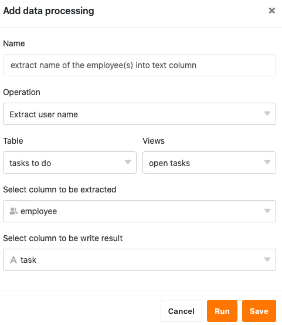

La fonction de traitement des données permet d'effectuer diverses opérations sur une colonne. Le **transfert de noms d'utilisateurs** est une opération qui permet de copier des données de colonnes de type [employé](https://seatable.io/fr/docs/datum-dauer-und-personen/die-spalte-mitarbeiter/), [créateur](https://seatable.io/fr/docs/datum-dauer-und-personen/die-spalten-ersteller-und-erstellt/) ou [dernier utilisateur](https://seatable.io/fr/docs/datum-dauer-und-personen/die-spalten-letzter-bearbeiter-und-zuletzt-bearbeitet/) dans une [colonne de texte](https://seatable.io/fr/docs/text-und-zahlen/die-spalten-text-und-formatierter-text/).

## Mise en place de l'opération

1. Ouvrez n'importe quel **tableau** et cliquez sur les **trois points** dans les options d'affichage.
2. Cliquez sur **Traitement des données**, puis sur **Ajouter une opération de traitement des données**.
3. Donnez un **nom** à l'opération et sélectionnez **Transférer le nom d'utilisateur**.

5. Définir le **tableau**, la **vue**, la **colonne source** et **la colonne résultat**.

7. Cliquez sur **Enregistrer** pour sauvegarder l'action et l'exécuter plus tard, ou sur **Exécuter** pour l'exécuter directement.

Lors de la première exécution réussie, une petite icône apparaît dans la marge inférieure gauche. **crochet vert**.  

## Exécution de l'opération

Par exemple, si vous gérez un tableau de tâches à effectuer dans lequel les **membres de votre équipe** sont saisis en tant que personnes de contact responsables dans une [colonne de collaborateurs](https://seatable.io/fr/docs/datum-dauer-und-personen/die-spalte-mitarbeiter/), vous pouvez simplement copier les noms d'utilisateur dans une [colonne de texte](https://seatable.io/fr/docs/text-und-zahlen/die-spalten-text-und-formatierter-text/), par exemple pour les utiliser dans une liste de collaborateurs.

Pour ce faire, suivez les étapes décrites ci-dessus et sélectionnez la colonne des collaborateurs comme **colonne source** et la colonne de texte comme **colonne de résultats**.

Si l'opération est effectuée avec succès, les **noms d'utilisateur sélectionnés** sont extraits de la colonne des collaborateurs et transférés dans la colonne de texte, séparés par une virgule.


