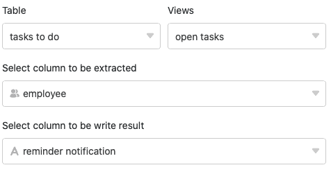

Usando a função de processamento de dados, é possível realizar várias operações através de uma coluna. A **transferência de nomes de utilizador** é uma operação que pode copiar dados de colunas do tipo [Empregado](), [Criador](https://seatable.io/pt/docs/datum-dauer-und-personen/die-spalten-ersteller-und-erstellt/) ou [Último Editor](https://seatable.io/pt/docs/datum-dauer-und-personen/die-spalten-letzter-bearbeiter-und-zuletzt-bearbeitet/) para uma [coluna de texto](https://seatable.io/pt/docs/text-und-zahlen/die-spalten-text-und-formatierter-text/).

## Pôr em prática a operação

1. Abrir qualquer **tabela** e clicar nos **três pontos** das opções de visualização.
2. Clique em **Data Processing** e depois em **Add Data Processing Operation**.
3. Dar um **nome** à operação e seleccionar **Transferir** nome de **utilizador**.

5. Definir **tabela**, **vista**, **coluna de origem** e **coluna de resultados**.

7. Clique em **Guardar para** guardar a acção e executá-la mais tarde, ou em **Executar** para executar a acção directamente.

A primeira vez que é executado com sucesso, um pequeno **carrapato verde**.  

## Execução da operação

Se, por exemplo, mantiver uma tabela com tarefas a realizar na qual **os membros da** sua **equipa** são registados como pessoas de contacto responsáveis numa [coluna de pessoal](), pode simplesmente copiar os nomes de utilizador para uma [coluna de texto](https://seatable.io/pt/docs/text-und-zahlen/die-spalten-text-und-formatierter-text/), por exemplo para os utilizar para uma lista de pessoal.

Para tal, seguir os passos descritos acima e seleccionar a coluna do pessoal como coluna de **origem** e a coluna de texto como coluna de **resultado**.

Se a operação for executada com sucesso, os **nomes de utilizador seleccionados** são extraídos da coluna de pessoal e transferidos para a coluna de texto separados por uma vírgula.


