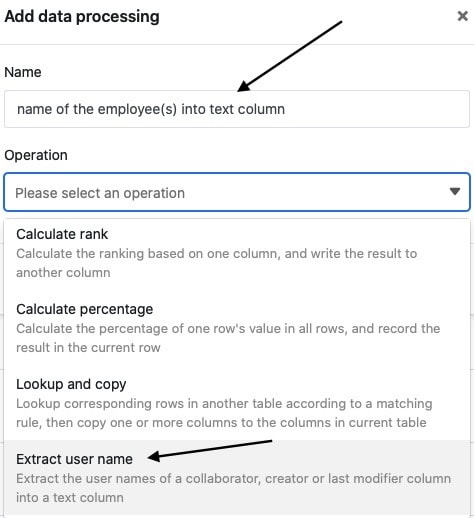

Используя функцию обработки данных, вы можете выполнять различные операции над столбцом. **Перенос имен пользователей** - это операция, которая может копировать данные из столбцов типа [Сотрудник](https://seatable.io/ru/docs/datum-dauer-und-personen/die-spalte-mitarbeiter/), [Создатель](https://seatable.io/ru/docs/datum-dauer-und-personen/die-spalten-ersteller-und-erstellt/) или [Последний редактор](https://seatable.io/ru/docs/datum-dauer-und-personen/die-spalten-letzter-bearbeiter-und-zuletzt-bearbeitet/) в [текстовый столбец](https://seatable.io/ru/docs/text-und-zahlen/die-spalten-text-und-formatierter-text/).

## Проведение операции

1. Откройте любую **таблицу** и нажмите на **три точки** в опциях просмотра.
2. Нажмите на **Обработка данных**, а затем на **Добавить операцию обработки данных**.
3. Дайте **название** операции и выберите **Передать** имя **пользователя**.

5. Определите **таблицу**, **представление**, **столбец источника** и **столбец результата**.

7. Нажмите на кнопку **Сохранить, чтобы** сохранить действие и выполнить его позже, или на кнопку **Выполнить**, чтобы выполнить действие напрямую.

В первый раз, когда он успешно выполняется, небольшой **зелёный клещ**.  

## Выполнение операции

Если, например, вы ведете таблицу с заданиями, в которой **члены** вашей **команды** записаны в качестве ответственных контактных лиц в [столбце сотрудников](https://seatable.io/ru/docs/datum-dauer-und-personen/die-spalte-mitarbeiter/), вы можете просто скопировать имена пользователей в [текстовый столбец](https://seatable.io/ru/docs/text-und-zahlen/die-spalten-text-und-formatierter-text/), например, чтобы использовать их для списка сотрудников.

Для этого выполните описанные выше действия и выберите столбец сотрудников в качестве **столбца-источника**, а столбец текста - в качестве **столбца-результата**.

Если операция выполнена успешно, **выбранные имена пользователей** извлекаются из столбца персонал и переносятся в текстовый столбец через запятую.


