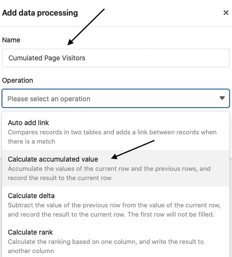
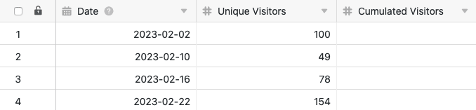

Con la función de tratamiento de datos, puede realizar varias operaciones en una columna. Una operación es el **cálculo de valores acumulados**, con el que puede acumular todos los valores de una columna numérica. Para ello, basta con definir la operación de tratamiento de datos correspondiente a través de las opciones de vista de la tabla.

## Puesta en marcha de la operación

1. Abra cualquier **tabla** y haga clic en los **tres puntos** de las opciones de vista.
2. Haga clic en **Proceso de datos** y luego en **Añadir operación de proceso de** datos.
3. Dé un **nombre** a la operación y seleccione **Calcular valores acumulados**.

5. Definir **tabla**, **vista**, **columna origen** y **columna resultado**.

7. Haga clic en **Guardar para** guardar la acción y ejecutarla más tarde, o en **Ejecutar** para ejecutar la acción directamente.

La primera vez que se ejecuta con éxito, un pequeño **garrapata verde**.  

## Caso práctico

Un caso de uso concreto de esta operación de tratamiento de datos podría darse, por ejemplo, si desea recoger en su tabla el número de accesos diarios a una página web. Para ello, desea **sumar** las **cifras de acceso de** cada día individual, que se registran en una [columna numérica]() existente, de fila en fila en una nueva columna.

Para la aplicación, primero se necesita una tabla en la que se recojan los distintos **días** en una columna de [fecha]() y los **números de acceso** al sitio web en una [columna de número]().

A continuación, añada una **segunda columna de números** a la tabla, en la que se calcularán los valores acumulados una vez realizada la operación de tratamiento de datos. La nueva columna Visitantes _acumulados_, inicialmente vacía, actúa como **columna de resultados en** la operación de tratamiento de datos, mientras que la columna _Visitantes únicos_ es la columna de **origen**.

Para crear la operación de tratamiento de datos, siga los pasos descritos anteriormente. A continuación, defina la **tabla** y la **vista** actualmente abiertas. Seleccione también la columna _Visitantes Únicos_ como columna de **origen** y la columna _Visitantes Acumulados_ recién añadida como columna de **resultado**.

Cada vez que se ejecuta la operación de tratamiento de datos, los **valores calculados** se escriben en la columna de resultados. Puede volver a ejecutar una operación guardada en cualquier momento a través de la ventana de tratamiento de datos. Los valores existentes en la columna de resultados se sobrescriben si es necesario.

