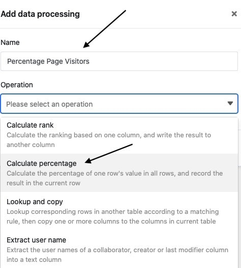
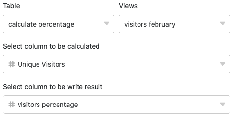
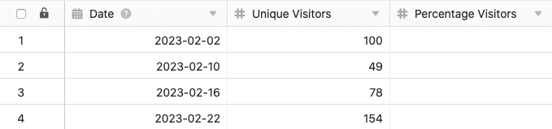
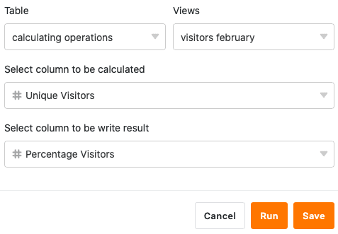
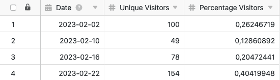
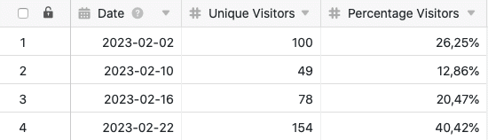

Mithilfe der Datenverarbeitungsfunktion können Sie diverse Operationen über eine Spalte hinweg durchführen. Eine Operation stellt dabei die **Berechnung prozentualer Anteile** dar, mit der Sie prozentualen Anteil eines Werts an der Summe aller Werte in einer Spalte berechnen können. Definieren Sie hierfür einfach eine entsprechende Datenverarbeitungsoperation über die Ansichtsoptionen Ihrer Tabelle.

## Anlegen der Datenverarbeitungsoperation

1. Öffnen Sie eine beliebige **Tabelle** und klicken Sie auf die **drei Punkte** in den Ansichtsoptionen.
2. Klicken Sie auf **Datenverarbeitung** und im Anschluss auf **Datenverarbeitungsoperation hinzufügen**.
3. Geben Sie der Operation einen **Namen** und wählen Sie **Prozentualen Anteil berechnen** aus.
   5. Definieren Sie **Tabelle**, **Ansicht**, **Quellspalte** und **Ergebnisspalte**.
   7. Klicken Sie auf **Speichern**, um die Aktion zu speichern und später auszuführen, oder auf **Ausführen**, um die Aktion direkt auszuführen.
   Bei der ersten erfolgreichen Ausführung erscheint am unteren linken Rand ein kleiner **grüner Haken**. 

## Anwendungsfall

Ein konkreter Anwendungsfall für diese Datenverarbeitungs-operation könnte beispielsweise auftreten, wenn Sie die Anzahl der täglichen Zugriffe auf eine Website erheben und herausfinden möchten, welchen Anteil die **Zugriffszahl eines Tages** an der Gesamtzahl der Zugriffe über alle Tage hinweg hat. Hierfür möchten Sie die **prozentualen Anteile** der täglichen Zugriffszahlen in einer weiteren Spalte berechnen.

Für die Umsetzung benötigen Sie zunächst eine Tabelle, in der die verschiedenen **Tage** in einer [Datum-Spalte]() und die **Zugriffszahlen** auf die Website in einer [Zahlen-Spalte]() erhoben werden.

Dann fügen Sie der Tabelle eine **zweite Zahlen-Spalte** hinzu, in welcher nach der Ausführung der Datenverarbeitungsoperation die prozentualen Werte berechnet werden. Die neue, zunächst noch leere Spalte _Percentage Visitors_ fungiert bei der Datenverarbeitungsoperation als **Ergebnisspalte**, während die Spalte _Unique Visitors_ die **Quellspalte** darstellt.

Um die Datenverarbeitungsoperation anzulegen, befolgen Sie die oben beschriebenen Schritte. Definieren Sie im Anschluss die aktuell geöffnete **Tabelle** und **Ansicht**. Wählen Sie zudem die Spalte _Unique Visitors_ als **Quellspalte** und die Spalte _Percentage Visitors_ als **Ergebnisspalte** aus.

Bei jeder Ausführung der Datenverarbeitungsoperation werden die **berechneten prozentualen Anteile** in die Ergebnisspalte geschrieben. Eine gespeicherte Operation können Sie jederzeit wieder über das Datenverarbeitungsfenster ausführen. Bereits vorhandene Werte in der Ergebnisspalte werden gegebenenfalls überschrieben.



Damit die errechneten Zahlen als Prozentwerte angezeigt werden, müssen Sie zuvor die **Formateinstellungen** der [Zahlen-Spalte]() anpassen. Dort wählen Sie als Format **Prozent** aus. Zudem können Sie als **Dezimaltrennzeichen** Punkt oder Komma einstellen und auf wie viele **Nachkommastellen** gerundet werden soll.



