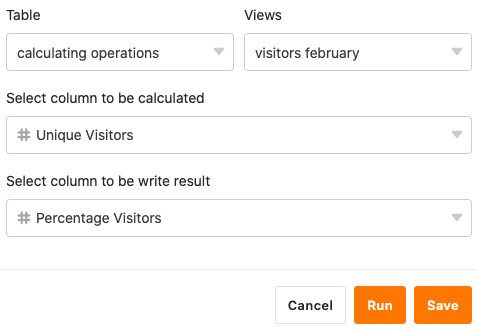

Con la ayuda de la función de tratamiento de datos, puede realizar varias operaciones en una columna. Una de ellas es el **cálculo de porcentajes**, con el que puede calcular el porcentaje de un valor en la suma de todos los valores de una columna. Para ello, basta con definir la operación de tratamiento de datos correspondiente a través de las opciones de vista de la tabla.

## Crear la operación de tratamiento de datos

1. Abra cualquier **tabla** y haga clic en los **tres puntos** de las opciones de vista.
2. Haga clic en **Proceso de datos** y luego en **Añadir operación de proceso de** datos.
3. Dé un **nombre** a la operación y seleccione **Calcular porcentaje**.

5. Definir **tabla**, **vista**, **columna origen** y **columna resultado**.

7. Haga clic en **Guardar para** guardar la acción y ejecutarla más tarde, o en **Ejecutar** para ejecutar la acción directamente.

La primera vez que se ejecuta con éxito, un pequeño **garrapata verde**.  

## Caso práctico

Un caso de uso concreto de esta operación de tratamiento de datos podría darse, por ejemplo, si se recoge el número de accesos diarios a un sitio web y se desea averiguar qué proporción tiene el número de accesos **de un día** sobre el número total de accesos de todos los días. Para ello, le gustaría calcular el **porcentaje** del número de accesos diarios en otra columna.

Para la aplicación, primero se necesita una tabla en la que se recojan los distintos **días** en una columna de [fecha]() y los **números de acceso** al sitio web en una [columna de número]().

A continuación, añada una **segunda columna de números** a la tabla en la que se calculan los valores porcentuales una vez realizada la operación de tratamiento de datos. La nueva columna _Porcentaje de visitantes_, inicialmente vacía, funciona como **columna de resultados en** la operación de tratamiento de datos, mientras que la columna _Visitantes únicos_ representa la columna de **origen**.

Para crear la operación de tratamiento de datos, siga los pasos descritos anteriormente. A continuación, defina la **tabla** y la **vista** actualmente abiertas. Seleccione también la columna _Visitantes únicos_ como columna de **origen** y la columna _Porcentaje de visitantes_ como columna de **resultado**.

Cada vez que se ejecuta la operación de tratamiento de datos, los **porcentajes calculados** se escriben en la columna de resultados. Puede volver a ejecutar una operación guardada en cualquier momento a través de la ventana de tratamiento de datos. Los valores existentes en la columna de resultados se sobrescriben si es necesario.



Para que los números calculados se muestren como porcentajes, primero debe ajustar la **configuración de formato de** la [columna de números](). Allí se selecciona **Porcentaje** como formato. También puede ajustar el **separador** **decimal** **a** punto o coma y el número de **decimales a** redondear.



