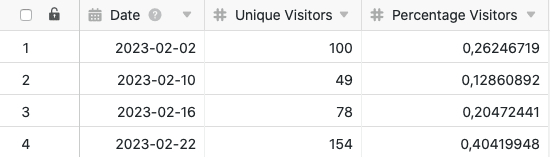

Com a ajuda da função de processamento de dados, pode realizar várias operações através de uma coluna. Uma operação é o **cálculo de quotas percentuais**, com a qual se pode calcular a quota percentual de um valor na soma de todos os valores de uma coluna. Para o fazer, basta definir uma operação de processamento de dados correspondente através das opções de visualização da sua tabela.

## Criar a operação de tratamento de dados

1. Abrir qualquer **tabela** e clicar nos **três pontos** das opções de visualização.
2. Clique em **Data Processing** e depois em **Add Data Processing Operation**.
3. Dê um **nome** à operação e seleccione **Calcular Percentagem**.

5. Definir **tabela**, **vista**, **coluna de origem** e **coluna de resultados**.

7. Clique em **Guardar para** guardar a acção e executá-la mais tarde, ou em **Executar** para executar a acção directamente.

A primeira vez que é executado com sucesso, um pequeno **carrapato verde**.  

## Estojo de utilização

Poderá ocorrer um caso concreto de utilização para esta operação de processamento de dados, por exemplo, se recolher o número de acessos diários a um website e quiser descobrir qual a quota do **número de acesso de um dia** do número total de acessos ao longo de todos os dias. Para este efeito, gostaria de calcular a **percentagem** dos números de acesso diários noutra coluna.

Para a implementação, é necessário primeiro um quadro em que os diferentes **dias** são recolhidos numa [coluna de datas](https://seatable.io/pt/docs/datum-dauer-und-personen/die-datum-spalte/) e os **números de acesso** ao website numa [coluna de números](https://seatable.io/pt/docs/text-und-zahlen/die-zahlen-spalte/).

Em seguida, adicionar uma **segunda coluna de números** à tabela na qual os valores percentuais são calculados após a operação de processamento de dados ter sido realizada. A nova coluna de _Visitantes Percentuais_, inicialmente vazia, funciona como a **coluna de resultados na** operação de processamento de dados, enquanto que a coluna de _Visitantes Únicos_ representa a coluna de **origem**.

Para criar a operação de processamento de dados, seguir os passos descritos acima. A seguir, defina a **tabela** e a **vista** actualmente abertas. Seleccionar também a coluna _Visitantes Únicos_ como coluna de **origem** e a coluna _Visitantes Percentuais_ como coluna de **resultado**.

Cada vez que a operação de processamento de dados é executada, as **percentagens calculadas** são escritas na coluna de resultados. Pode-se executar novamente uma operação gravada em qualquer altura através da janela de processamento de dados. Os valores existentes na coluna de resultados serão escritos por cima, se necessário.



