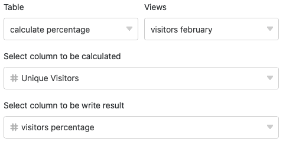
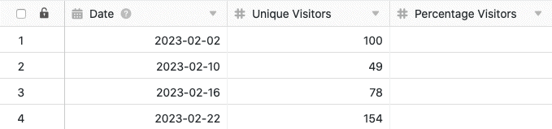

С помощью функции обработки данных можно выполнять различные операции над столбцом. Одной из операций является **вычисление процентных долей**, с помощью которой можно вычислить процентную долю значения в сумме всех значений в столбце. Для этого просто определите соответствующую операцию обработки данных через параметры представления вашей таблицы.

## Создайте операцию обработки данных

1. Откройте любую **таблицу** и нажмите на **три точки** в опциях просмотра.
2. Нажмите на **Обработка данных**, а затем на **Добавить операцию обработки данных**.
3. Дайте **название** операции и выберите **Вычислить процент**.

5. Определите **таблицу**, **представление**, **столбец источника** и **столбец результата**.

7. Нажмите на кнопку **Сохранить, чтобы** сохранить действие и выполнить его позже, или на кнопку **Выполнить**, чтобы выполнить действие напрямую.

В первый раз, когда он успешно выполняется, небольшой **зелёный клещ**.  

## Пример использования

Конкретный случай использования этой операции обработки данных может возникнуть, например, если вы собираете данные о количестве ежедневных обращений к веб-сайту и хотите выяснить, какую долю составляет **количество обращений за один день** от общего количества обращений за все дни. Для этого вы хотите рассчитать **процентное соотношение** количества ежедневных обращений в другом столбце.

Для реализации сначала нужна таблица, в которой различные **дни** собраны в [столбце даты](), а **номера доступа** к сайту - в [столбце числа]().

Затем добавьте в таблицу **второй столбец с числами**, в котором будут рассчитаны процентные значения после выполнения операции обработки данных. Новый, изначально пустой столбец _Процент посетителей_ функционирует как **столбец результата в** операции обработки данных, а столбец _Уникальные посетители_ представляет собой столбец **источника**.

Чтобы создать операцию обработки данных, выполните описанные выше действия. Далее определите текущую открытую **таблицу** и **представление**. Также выберите столбец _Unique Visitors_ в качестве **исходного** столбца и столбец _Percentage Visitors_ в качестве столбца **результата**.

При каждом выполнении операции обработки данных **вычисленные проценты** записываются в колонку результатов. Вы можете в любое время повторно выполнить сохраненную операцию через окно обработки данных. При необходимости существующие значения в колонке результатов перезаписываются.



Для того чтобы вычисленные числа отображались в виде процентов, необходимо сначала настроить **параметры формата** [столбца чисел](). Там вы выбираете формат **Проценты**. Вы также можете установить **десятичный** **разделитель**: точка или запятая, а также количество **знаков после запятой для** округления.



