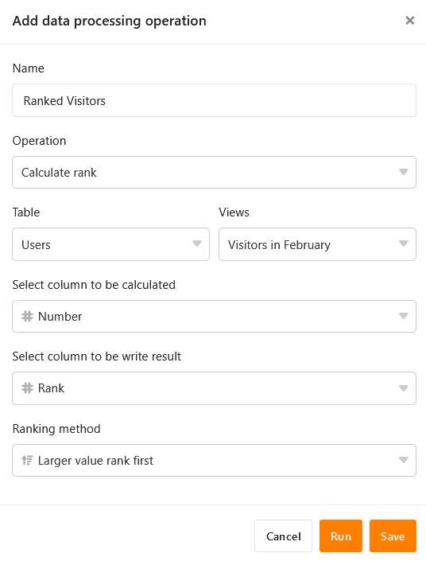
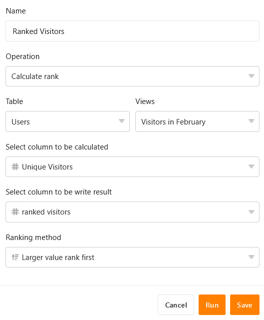

Mithilfe der Datenverarbeitungsfunktion können Sie diverse Operationen über eine Spalte hinweg durchführen. Eine Operation stellt dabei die **Berechnungen von Ranglisten** dar, mit der Sie alle Werte einer numerischen Spalte in eine Rangordnung bringen können. Definieren Sie hierfür einfach eine entsprechende Datenverarbeitungsoperation über die Ansichtsoptionen Ihrer Tabelle.

## Anlegen der Operation

1. Öffnen Sie eine beliebige **Tabelle** und klicken Sie auf die **drei Punkte** in den Ansichtsoptionen.
2. Klicken Sie auf **Datenverarbeitung** und im Anschluss auf **Datenverarbeitungsoperation hinzufügen**.
3. Geben Sie der Operation einen **Namen** und wählen Sie **Rangliste berechnen** aus.
   5. Definieren Sie **Tabelle**, **Ansicht**, **Quellspalte** und **Ergebnisspalte**. Zudem können Sie auswählen, in welcher **Reihenfolge** die Werte aufgelistet werden sollen. Geben Sie dafür an, ob der größte oder der kleinste Wert an erster Stelle stehen soll.

 7. Klicken Sie auf **Speichern**, um die Aktion zu speichern und später auszuführen, oder auf **Ausführen**, um die Aktion direkt auszuführen.
Bei der ersten erfolgreichen Ausführung erscheint am unteren linken Rand ein kleiner **grüner Haken**. 

## Anwendungsfall

Ein konkreter Anwendungsfall für diese Datenverarbeitungs-operation könnte beispielsweise auftreten, wenn Sie die Anzahl der täglichen Zugriffe auf eine Website in einer Spalte erheben und diese in eine **Rangordnung** (im Vergleich zu den anderen Spaltenwerten) bringen möchten. Hierfür möchten Sie den täglichen **Zugriffszahlen** separat in einer weiteren Spalte **Ränge** zuweisen.

Für die Umsetzung benötigen Sie zunächst eine Tabelle, in der die verschiedenen **Tage** in einer [Datum-Spalte](https://seatable.io/docs/datum-dauer-und-personen/die-datum-spalte/) und die **Zugriffszahlen** auf die Website in einer [Zahlen-Spalte](https://seatable.io/docs/text-und-zahlen/die-zahlen-spalte/) erhoben werden.

Dann fügen Sie der Tabelle eine **zweite Zahlen-Spalte** hinzu, in welche nach der Ausführung der Datenverarbeitungsoperation die Ränge der verschiedenen täglichen Zugriffszahlen eingetragen werden. Die neue, zunächst noch leere Spalte _ranked visitors_ fungiert bei der Datenverarbeitungsoperation als **Ergebnisspalte**, während die Spalte _Unique Visitors_ die **Quellspalte** darstellt.

Um die Datenverarbeitungsoperation anzulegen, befolgen Sie die oben beschriebenen Schritte. Definieren Sie im Anschluss die aktuell geöffnete **Tabelle** und **Ansicht**. Wählen Sie zudem die Spalte _Unique Visitors_ als **Quellspalte** und die neu hinzugefügte Spalte _ranked visitors_ als **Ergebnisspalte** aus.

Bei jeder Ausführung der Datenverarbeitungsoperation werden die **berechneten Ränge** in die Ergebnisspalte geschrieben. Eine gespeicherte Operation können Sie jederzeit wieder über das Datenverarbeitungsfenster ausführen. Bereits vorhandene Werte in der Ergebnisspalte werden gegebenenfalls überschrieben.

