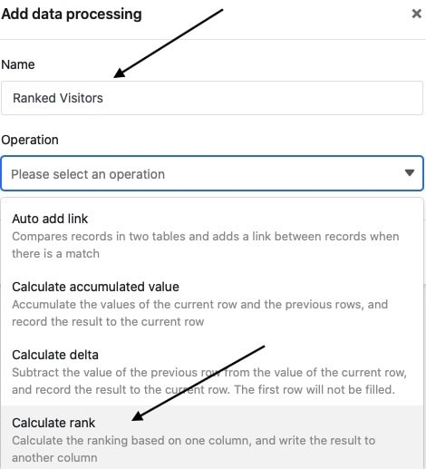
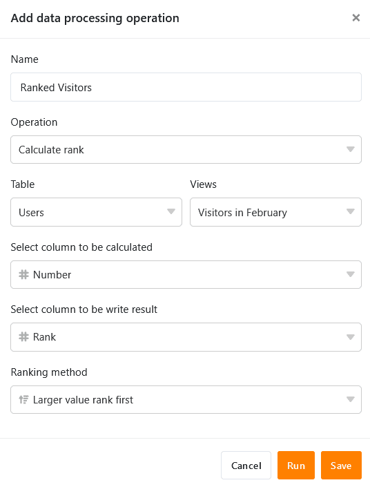
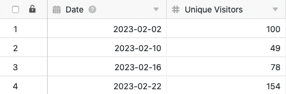
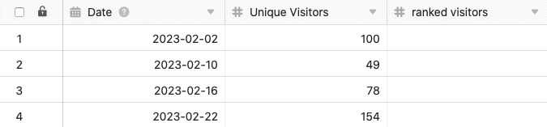
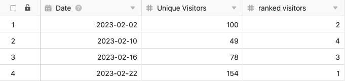

Using the data processing function, you can perform various operations over a column. One operation is the **calculation of rank** ings, which allows you to rank all the values in a numeric column. To do this, simply define an appropriate data processing operation using the view options of your table.

## Putting on the operation

1. Open any **table** and click the **three dots** in the view options.
2. Click **Data Processing**, and then click **Add Data Processing Operation**.
3. Give the operation a **name** and select **Calculate Ranking**.

5. Define the **table**, **view**, **source column** and **result column**. You can also select the **order** in which the values are to be listed. Specify whether the largest or the smallest value should be listed first.

7. Click **Save to** save the action and execute it later, or **Execute** to execute the action directly.

On the first successful execution, a small **Green hook**.  

## Use case

A concrete use case for this data processing operation could occur, for example, if you want to collect the number of daily accesses to a website in a column and **rank** them (in comparison to the other column values). For this purpose, you want to assign **ranks** to the daily **access numbers** separately in another column.

For the implementation you first need a table in which the different **days** are collected in a [date column](https://seatable.io/en/docs/datum-dauer-und-personen/die-datum-spalte/) and the **access numbers to** the website in a [number column](https://seatable.io/en/docs/text-und-zahlen/die-zahlen-spalte/).

Then add a **second column of numbers** to the table, in which the ranks of the various daily access numbers are entered after the data processing operation has been executed. The new, initially empty, _ranked visitors_ column acts as the **result column in** the data processing operation, while the _Unique Visitors_ column is the **source** column.

To create the data processing operation, follow the steps described above. Next, define the currently opened **table** and **view.** Also, select the _Unique Visitors_ column as the **source** column and the newly added _ranked visitors_ column as the **result** column.

Each time the data processing operation is executed, the **calculated ranks** are written to the results column. You can execute a saved operation again at any time via the data processing window. Existing values in the result column will be overwritten if necessary.

