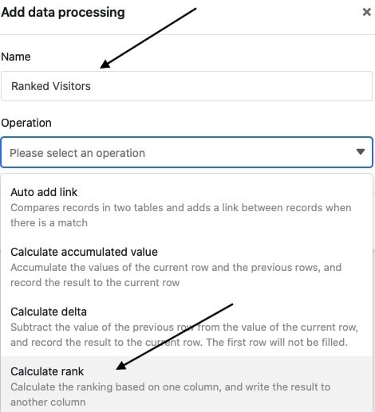

Con la ayuda de la función de tratamiento de datos, puede realizar varias operaciones en una columna. Una de estas operaciones es el **cálculo de clasificaciones**, que le permite clasificar todos los valores de una columna numérica. Para ello, basta con definir la operación de tratamiento de datos correspondiente en las opciones de vista de la tabla.

## Puesta en marcha de la operación

1. Abra cualquier **tabla** y haga clic en los **tres puntos** de las opciones de vista.
2. Haga clic en **Proceso de datos** y luego en **Añadir operación de proceso de** datos.
3. Asigne un **nombre** a la operación y seleccione **Calcular clasificación**.

5. Defina la **tabla**, la **vista**, la **columna de origen** y la **columna de resultado**. También puede seleccionar el **orden** en que deben listarse los valores. Especifique si debe listarse primero el valor más grande o el más pequeño.

7. Haga clic en **Guardar para** guardar la acción y ejecutarla más tarde, o en **Ejecutar** para ejecutar la acción directamente.

La primera vez que se ejecuta con éxito, un pequeño **garrapata verde**.  

## Caso práctico

Un caso de uso concreto de esta operación de tratamiento de datos podría darse, por ejemplo, si se desea recoger el número de accesos diarios a un sitio web en una columna y **clasificarlos** (en comparación con los valores de las demás columnas). Para ello, desea asignar **rangos** a los **números** de acceso diario por separado en otra columna.

Para la aplicación, primero se necesita una tabla en la que se recojan los distintos **días** en una columna de [fecha](https://seatable.io/es/docs/datum-dauer-und-personen/die-datum-spalte/) y los **números de acceso** al sitio web en una [columna de número](https://seatable.io/es/docs/text-und-zahlen/die-zahlen-spalte/).

A continuación, añada una **segunda columna de números** a la tabla, en la que se introducirán los rangos de los distintos números de acceso diario una vez ejecutada la operación de tratamiento de datos. La nueva columna de _visitantes clasificados_, inicialmente vacía, funciona como **columna de resultados en** la operación de tratamiento de datos, mientras que la columna de _visitantes_ únicos representa la columna de **origen**.

Para crear la operación de tratamiento de datos, siga los pasos descritos anteriormente. A continuación, defina la **tabla** y la **vista** actualmente abiertas. Seleccione también la columna de visitantes _únicos_ como columna de **origen** y la columna de _visitantes clasificados_ recién añadida como columna de **resultado**.

Cada vez que se ejecuta la operación de tratamiento de datos, los **rangos calculados** se escriben en la columna de resultados. Puede volver a ejecutar una operación guardada en cualquier momento a través de la ventana de tratamiento de datos. Los valores existentes en la columna de resultados se sobrescriben si es necesario.

