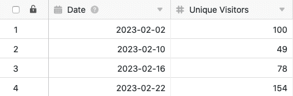

Com a ajuda da função de processamento de dados, pode realizar várias operações através de uma coluna. Uma operação é o **cálculo de rankings**, que lhe permite classificar todos os valores numa coluna numérica. Para o fazer, basta definir uma operação de processamento de dados correspondente através das opções de visualização da sua tabela.

## Pôr em prática a operação

1. Abrir qualquer **tabela** e clicar nos **três pontos** das opções de visualização.
2. Clique em **Data Processing** e depois em **Add Data Processing Operation**.
3. Dar um **nome** à operação e seleccionar **Calcular o Ranking**.

5. Definir a **tabela**, a **vista**, a **coluna de origem** e **a coluna de resultados**. Também é possível selecionar a **ordem** em que os valores devem ser listados. Especifique se o maior ou o menor valor deve ser listado primeiro.

7. Clique em **Guardar para** guardar a acção e executá-la mais tarde, ou em **Executar** para executar a acção directamente.

A primeira vez que é executado com sucesso, um pequeno **carrapato verde**.  

## Estojo de utilização

Poderá ocorrer um caso concreto de utilização para esta operação de processamento de dados, por exemplo, se quiser recolher o número de acessos diários a um sítio web numa coluna e **classificá-los** (em comparação com os outros valores de coluna). Para o fazer, pretende atribuir **classificações** aos **números de acesso** diário separadamente noutra coluna.

Para a implementação, é necessário primeiro um quadro em que os diferentes **dias** são recolhidos numa [coluna de datas]() e os **números de acesso** ao website numa [coluna de números]().

Em seguida, adicionar uma **segunda coluna de números** à tabela, na qual as classificações dos vários números de acesso diários são introduzidas após a operação de processamento de dados ter sido executada. A nova coluna de _visitantes_, inicialmente vazia, funciona como a **coluna de resultados na** operação de processamento de dados, enquanto que a coluna de _Visitantes Únicos_ representa a coluna de **origem**.

Para criar a operação de processamento de dados, seguir os passos descritos acima. Em seguida, defina a **tabela** e a **vista** actualmente abertas. Seleccionar também a coluna _Visitantes Únicos_ como coluna de **origem** e a coluna de _visitantes_ recém-adicionada como coluna de **resultados**.

Cada vez que a operação de processamento de dados é executada, as **classificações calculadas** são escritas na coluna de resultados. Pode-se executar novamente uma operação gravada em qualquer altura através da janela de processamento de dados. Os valores existentes na coluna de resultados são escritos por cima, se necessário.

