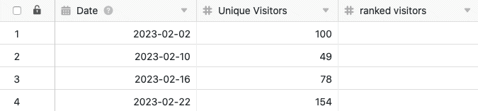
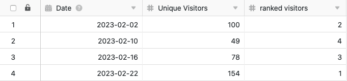

С помощью функции обработки данных можно выполнять различные операции над столбцом. Одной из операций является **вычисление рангов**, которое позволяет ранжировать все значения в числовом столбце. Для этого просто определите соответствующую операцию обработки данных в параметрах представления таблицы.

## Проведение операции

1. Откройте любую **таблицу** и нажмите на **три точки** в опциях просмотра.
2. Нажмите на **Обработка данных**, а затем на **Добавить операцию обработки данных**.
3. Дайте **название** операции и выберите **Расчет рейтинга**.

5. Определите **таблицу**, **представление**, **столбец источника** и **столбец результата**. Можно также выбрать **порядок**, в котором будут перечислены значения. Укажите, какое значение должно быть перечислено первым - наибольшее или наименьшее.

7. Нажмите на кнопку **Сохранить, чтобы** сохранить действие и выполнить его позже, или на кнопку **Выполнить**, чтобы выполнить действие напрямую.

В первый раз, когда он успешно выполняется, небольшой **зелёный клещ**.  

## Пример использования

Конкретный случай использования этой операции обработки данных может возникнуть, например, если вы хотите собрать в столбце количество ежедневных обращений к веб-сайту и **ранжировать** их (по сравнению с другими значениями столбца). Для этого необходимо присвоить **ранги** **номерам** ежедневных **доступов** отдельно в другом столбце.

Для реализации сначала нужна таблица, в которой различные **дни** собраны в [столбце даты](), а **номера доступа** к сайту - в [столбце числа]().

Затем добавьте в таблицу **второй столбец чисел**, в который после выполнения операции обработки данных вносятся ранги различных номеров ежедневных посещений. Новая, изначально пустая колонка _ранжированных посетителей_ функционирует как **колонка результата в** операции обработки данных, в то время как колонка _уникальных посетителей_ представляет собой колонку **источника**.

Чтобы создать операцию обработки данных, выполните описанные выше действия. Затем определите текущую открытую **таблицу** и **представление**. Также выберите столбец _Уникальные посетители_ в качестве **исходного** столбца и недавно добавленный столбец _Ранжированные посетители_ в качестве столбца **результата**.

При каждом выполнении операции обработки данных **вычисленные ранги** записываются в колонку результатов. Вы можете в любое время повторно выполнить сохраненную операцию через окно обработки данных. При необходимости существующие значения в колонке результатов перезаписываются.

