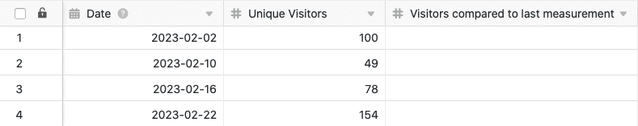

Con la función de tratamiento de datos, puede realizar varias operaciones en una columna. Una operación es el **cálculo de cambios**, con el que puede calcular los cambios de valor a valor en una columna numérica. Para ello, basta con definir la operación de tratamiento de datos correspondiente a través de las opciones de vista de la tabla.

## Puesta en marcha de la operación

1. Abra cualquier **tabla** y haga clic en los **tres puntos** de las opciones de vista.
2. Haga clic en **Proceso de datos** y luego en **Añadir operación de proceso de** datos.
3. Asigne un **nombre** a la operación y seleccione **Calcular cambios**.

5. Definir **tabla**, **vista**, **columna origen** y **columna resultado**.

7. Haga clic en **Guardar para** guardar la acción y ejecutarla más tarde, o en **Ejecutar** para ejecutar la acción directamente.

La primera vez que se ejecuta con éxito, un pequeño **garrapata verde**.  

## Caso práctico

Un caso de uso concreto para esta operación de tratamiento de datos podría ser, por ejemplo, si recoge el número de accesos diarios a un sitio web y desea averiguar cómo han cambiado **los** números de acceso en el periodo entre dos mediciones. Para ello, desea calcular la **diferencia** entre los números de acceso en otra columna.

Para la aplicación, primero se necesita una tabla en la que se recojan los distintos **días** en una columna de [fecha](https://seatable.io/es/docs/datum-dauer-und-personen/die-datum-spalte/) y los **números de acceso** al sitio web en una [columna de número](https://seatable.io/es/docs/text-und-zahlen/die-zahlen-spalte/).

A continuación, añada una **segunda columna de números** a la tabla, en la que se calculará la variación de los números de acceso diarios una vez realizada la operación de tratamiento de datos. La nueva columna _Visitantes_ inicialmente vacía _comparada con la última medición_ funciona como **columna de resultados en** la operación de tratamiento de datos, mientras que la columna _Visitantes_ únicos representa la columna de **origen**.

Para crear la operación de tratamiento de datos, siga los pasos descritos anteriormente. A continuación, defina la **tabla** y la **vista** actualmente abiertas. Seleccione también la columna _Visitantes únicos_ como columna de **origen** y la columna _Visitantes comparados con la última medición_ como columna de **resultado**.

Cada vez que se ejecuta la operación de tratamiento de datos, los **valores calculados** se escriben en la columna de resultados. Puede volver a ejecutar una operación guardada en cualquier momento a través de la ventana de tratamiento de datos. Los valores existentes en la columna de resultados se sobrescriben si es necesario.

