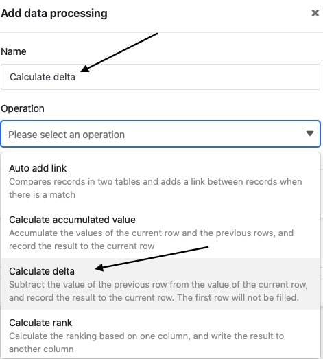

La fonction de traitement des données vous permet d'effectuer diverses opérations sur une colonne. L'une de ces opérations est le **calcul des variations**, qui vous permet de calculer les variations de valeur à valeur dans une colonne numérique. Pour ce faire, il suffit de définir une opération de traitement des données correspondante via les options d'affichage de votre tableau.

## Mise en place de l'opération

1. Ouvrez n'importe quel **tableau** et cliquez sur les **trois points** dans les options d'affichage.
2. Cliquez sur **Traitement des données**, puis sur **Ajouter une opération de traitement des données**.
3. Donnez un **nom** à l'opération et sélectionnez **Calculer les changements**.

5. Définir le **tableau**, la **vue**, la **colonne source** et **la colonne résultat**.

7. Cliquez sur **Enregistrer** pour sauvegarder l'action et l'exécuter plus tard, ou sur **Exécuter** pour l'exécuter directement.

Lors de la première exécution réussie, une petite icône apparaît dans la marge inférieure gauche. **crochet vert**.  

## Cas d'utilisation

Une application concrète de cette opération de traitement des données pourrait par exemple se produire si vous relevez le nombre de visites quotidiennes d'un site web et souhaitez savoir comment le **nombre de visites** a évolué entre deux mesures. Pour ce faire, vous souhaitez calculer la **différence** entre les chiffres d'accès dans une colonne supplémentaire.

Pour la mise en œuvre, vous avez d'abord besoin d'un tableau dans lequel les différents **jours** sont relevés dans une [colonne de dates]() et le **nombre de visites** sur le site dans une [colonne de chiffres]().

Ensuite, vous ajoutez une **deuxième colonne de chiffres** au tableau, dans laquelle la variation du nombre de visites quotidiennes est calculée après l'exécution de l'opération de traitement des données. La nouvelle colonne _Visitors compared to last measurement_, initialement vide, fait office de **colonne de résultats** lors de l'opération de traitement des données, tandis que la colonne _Unique Visitors_ représente la **colonne source**.

Pour créer l'opération de traitement des données, suivez les étapes décrites ci-dessus. Définissez ensuite le **tableau** et la **vue** actuellement ouverts. Sélectionnez également la colonne _Visiteurs uniques_ comme **colonne source** et la colonne _Visiteurs comparés à la dernière mesure_ comme **colonne de résultats**.

Chaque fois que l'opération de traitement des données est exécutée, les **valeurs calculées** sont écrites dans la colonne des résultats. Vous pouvez à tout moment exécuter à nouveau une opération enregistrée via la fenêtre de traitement des données. Les valeurs déjà présentes dans la colonne des résultats sont éventuellement écrasées.

