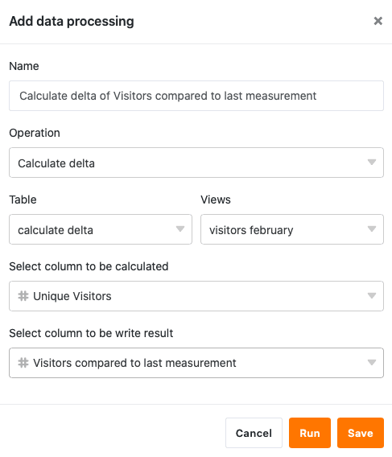

Usando a função de processamento de dados, é possível realizar várias operações através de uma coluna. Uma operação é o **cálculo das alterações**, com a qual se podem calcular as alterações de valor para valor numa coluna numérica. Para o fazer, basta definir uma operação de processamento de dados correspondente através das opções de visualização da sua tabela.

## Pôr em prática a operação

1. Abrir qualquer **tabela** e clicar nos **três pontos** das opções de visualização.
2. Clique em **Data Processing** e depois em **Add Data Processing Operation**.
3. Dar um **nome** à operação e seleccionar **Calcular alterações**.

5. Definir **tabela**, **vista**, **coluna de origem** e **coluna de resultados**.

7. Clique em **Guardar para** guardar a acção e executá-la mais tarde, ou em **Executar** para executar a acção directamente.

A primeira vez que é executado com sucesso, um pequeno **carrapato verde**.  

## Estojo de utilização

Um caso concreto de utilização para esta operação de processamento de dados poderia ser, por exemplo, se recolher o número de acessos diários a um website e quiser descobrir como é que os **números de acesso** mudaram no período entre duas medições. Para tal, pretende calcular a **diferença** entre os números de acesso noutra coluna.

Para a implementação, é necessário primeiro um quadro em que os diferentes **dias** são recolhidos numa [coluna de datas]() e os **números de acesso** ao website numa [coluna de números]().

Em seguida, adicionar uma **segunda coluna de números** à tabela, na qual a alteração dos números de acesso diários é calculada após a operação de processamento de dados ter sido realizada. A nova coluna _Visitantes_, inicialmente vazia, _comparada com as últimas_ funções de _medição_, como **coluna de resultados na** operação de processamento de dados, enquanto que a coluna _Visitantes Únicos_ representa a coluna de **origem**.

Para criar a operação de processamento de dados, seguir os passos descritos acima. Em seguida, defina a **tabela** e a **vista** actualmente abertas. Seleccionar também a coluna _Visitantes Únicos_ como coluna de **origem** e os _Visitantes em comparação com a última_ coluna de _medição_ como coluna de **resultados**.

Cada vez que a operação de processamento de dados é executada, os **valores calculados** são escritos na coluna de resultados. Pode-se executar novamente uma operação gravada em qualquer altura através da janela de processamento de dados. Os valores existentes na coluna de resultados são escritos por cima, se necessário.

