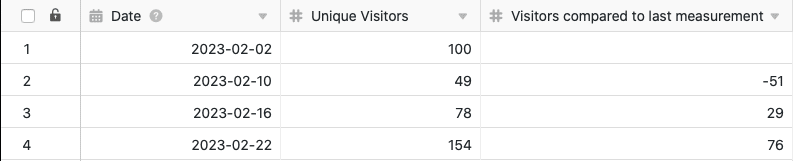

Используя функцию обработки данных, вы можете выполнять различные операции над столбцом. Одной из операций является **вычисление изменений**, с помощью которой можно вычислить изменения от значения к значению в числовом столбце. Для этого просто определите соответствующую операцию обработки данных в параметрах представления таблицы.

## Проведение операции

1. Откройте любую **таблицу** и нажмите на **три точки** в опциях просмотра.
2. Нажмите на **Обработка данных**, а затем на **Добавить операцию обработки данных**.
3. Дайте **название** операции и выберите **Вычислить изменения**.

5. Определите **таблицу**, **представление**, **столбец источника** и **столбец результата**.

7. Нажмите на кнопку **Сохранить, чтобы** сохранить действие и выполнить его позже, или на кнопку **Выполнить**, чтобы выполнить действие напрямую.

В первый раз, когда он успешно выполняется, небольшой **зелёный клещ**.  

## Пример использования

Конкретным примером использования этой операции по обработке данных может быть, например, сбор данных о количестве ежедневных посещений веб-сайта и выяснение того, как изменилось **количество посещений** за период между двумя измерениями. Для этого нужно вычислить **разницу** между числами доступа в другом столбце.

Для реализации сначала нужна таблица, в которой различные **дни** собраны в [столбце даты](), а **номера доступа** к сайту - в [столбце числа]().

Затем добавьте в таблицу **второй столбец чисел**, в котором рассчитывается изменение ежедневных чисел доступа после выполнения операции обработки данных. Новая, изначально пустая колонка _Посетители по сравнению с последним измерением_ функционирует как **колонка результата в** операции обработки данных, в то время как колонка _Уникальные посетители_ представляет собой колонку **источника**.

Чтобы создать операцию обработки данных, выполните описанные выше действия. Затем определите текущую открытую **таблицу** и **представление**. Также выберите столбец _Уникальные посетители_ в качестве **исходного** столбца и столбец _Посетители по сравнению с последним измерением_ в качестве столбца **результата**.

При каждом выполнении операции обработки данных **вычисленные значения** записываются в колонку результатов. Вы можете в любое время повторно выполнить сохраненную операцию через окно обработки данных. При необходимости существующие значения в колонке результатов перезаписываются.

