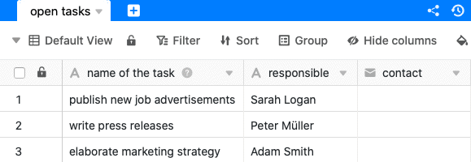

Mithilfe der Datenverarbeitungsfunktion können Sie diverse Operationen über eine Spalte hinweg durchführen. **Vergleichen und kopieren** stellt dabei eine Operation dar, mit der Sie die Werte einer Spalte von einer Tabelle in die Spalte einer anderen Tabelle kopieren können, sofern ein bestimmter Vergleichswert in beiden Datensätzen identisch ist.

## Anlegen der Operation

1. Öffnen Sie eine beliebige **Tabelle** und klicken Sie auf die **drei Punkte** in den Ansichtsoptionen.
2. Klicken Sie auf **Datenverarbeitung** und im Anschluss auf **Datenverarbeitungsoperation hinzufügen**.
3. Geben Sie der Operation einen **Namen** und wählen Sie **Vergleichen und kopieren** aus.
   5. Definieren Sie, **aus welcher Tabelle** die Daten stammen und **in welche Tabelle** Sie die Daten kopieren möchten.
4. Legen Sie eine oder mehrere **Bedingungen** fest, in welchen zwei Spalten der verglichenen Tabellen ein Wert identisch sein muss, damit die Operation ausgeführt wird.
5. Wählen Sie eine oder mehrere **Quellspalten**, aus denen Werte in ebenfalls zu definierende **Ergebnisspalten** kopiert werden, sofern die von Ihnen festgelegten Übereinstimmungsbedingungen erfüllt sind.
    12. Klicken Sie auf **Speichern**, um die Aktion zu speichern und später auszuführen, oder auf **Ausführen**, um die Aktion direkt auszuführen.
   Bei der ersten erfolgreichen Ausführung erscheint am unteren linken Rand ein kleiner **grüner Haken**. 

## Anwendungsfall

Ein konkreter Anwendungsfall für diese Datenverarbeitungs-operation könnte beispielsweise auftreten, wenn Sie die **Mitarbeiterdaten** Ihrer Teammitglieder in einer Tabelle pflegen und die noch zu erledigenden **Aufgaben Ihres Teams** in einer neuen Tabelle anlegen möchten. Durch Hinzufügen einer Spalte mit den **Namen** der für die jeweiligen Aufgaben zuständigen Mitarbeiter wollen Sie eine Übereinstimmung zwischen den Tabellen schaffen.

Anschließend möchten Sie, dass bestimmte Daten der Mitarbeiter, welche bereits in der Mitarbeiter-Tabelle vorhanden sind, in die Aufgaben-Tabelle kopiert werden. Beispielsweise könnten Sie dort auch die **E-Mail-Adresse** brauchen, um direkt Kontakt zur zuständigen Person aufnehmen zu können.

Zur Umsetzung dieser Datenverarbeitungsoperation benötigen Sie **zwei Tabellen in derselben Base**. In der ersten Tabelle werden die **Mitarbeiterdaten** gepflegt, zu denen unter anderem die **E-Mail-Adressen** der Mitarbeiter gehören.

In der zweiten Tabelle erfassen Sie die **offenen Aufgaben**, für die der jeweils zuständige Mitarbeiter in einer weiteren Spalte eingetragen wird. Außerdem legen Sie eine neue Spalte vom Typ [E-Mail]() an, in die später die E-Mail-Adressen kopiert werden sollen.

Um die Datenverarbeitungsoperation anzulegen, befolgen Sie die oben beschriebenen Schritte. Für den konkreten Anwendungsfall wählen Sie dabei als **Bedingung** aus, dass der Name eines Mitarbeiters in der Spalte **name** in der Tabelle **employees** mit dem Namen in der Spalte **responsible** in der Tabelle **open tasks** übereinstimmen muss. Dieser Schritt ist essenziell, damit bei der Datenverarbeitungsoperation die korrekten Daten der entsprechenden Mitarbeiter kopiert werden.

 

Im nächsten Schritt können Sie eine beliebige Anzahl an Quellspalten aus der Tabelle **employees** auswählen, deren Inhalte bei Ausführung der Operation und Zutreffen der gerade definierten Übereinstimmungsbedingung in die ausgewählten Ergebnisspalten der Tabelle **open tasks** kopiert werden.



Die Quell- und Ergebnisspalten sollten **den gleichen Spaltentyp** aufweisen, damit beim Kopieren keine Daten verloren gehen. Sie können zwar beispielsweise Daten aus einer [Datum-Spalte]() in eine [Text-Spalte]() kopieren, diese eignen sich dann aber nicht mehr für [Kalender](). Legen Sie also vor der Ausführung der Operation für jede **Quellspalte**, die Sie kopieren möchten, eine **Ergebnisspalte** des gleichen Typs in der Ziel-Tabelle an."



Bei erfolgreicher Ausführung der Operation werden die Tabellen **employees** und **open tasks** auf Übereinstimmungen in den definierten Spalten **name** und **responsible** untersucht. Stimmen dabei die **Namen** in den Spalten beider Tabellen überein, wird die **E-Mail-Adresse** des entsprechenden Mitarbeiters aus der definierten Spalte **E-Mail** automatisch in die Ergebnisspalte **contact** kopiert.



Um eine leichte Verständlichkeit zu ermöglichen, haben wir uns im Anwendungsfall dazu entschieden, lediglich **eine Spalte** mithilfe der Datenverarbeitungsoperation zu kopieren. Um die Wirkung zu erhöhen, können Sie selbstverständlich auch eine größere Anzahl an Quell- und Ergebnisspalten auswählen.



## Nicht unterstützte Spaltentypen

Folgende Spaltentypen können Sie mithilfe der Operation _Vergleichen und kopieren_ **nicht** kopieren und stehen Ihnen dementsprechend bei der Definition der Quell- und Ergebnisspalten **nicht** zur Verfügung.

- [Mehrfachauswahl-Spalte]()
- [Die Spalte Ersteller]()
- [Die Spalte Letzter Bearbeiter]()
- [Schaltfläche]()
