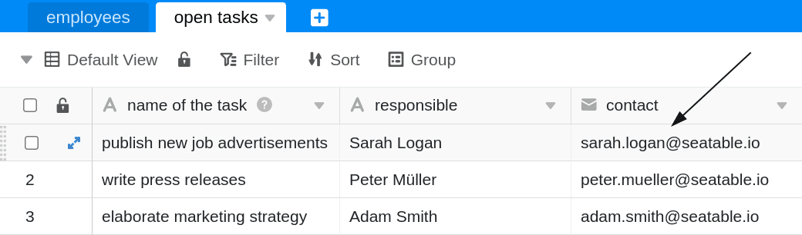

You can use the data processing function to perform various operations across a column. **Compare and copy** is an operation with which you can copy the values of a column from one table to the column of another table, provided that a certain comparison value is identical in both data records.

## Putting on the operation

1. Open any **table** and click the **three dots** in the view options.
2. Click **Data Processing**, and then click **Add Data Processing Operation**.
3. Give the operation a **name** and select **Compare and Copy**.

5. Define **from which table** the data originates and **to which table** you want to copy the data.
6. Set one or more **conditions** in which two columns of the compared tables must have a value identical for the operation to be performed.
7. Select one or more **source columns** from which values will be copied to **result columns** that you also define, provided that the match conditions you specify are met.



11. Click **Save to** save the action and execute it later, or **Execute** to execute the action directly.

On the first successful execution, a small **Green hook**.  

## Use case

A concrete use case for this data processing operation could occur, for example, if you maintain the **employee data of** your team members in one table and want to create the **tasks of your team** that still need to be completed in a new table. By adding a column with the **names of** the employees responsible for the respective tasks, you want to create a match between the tables.

Subsequently, you want certain data of the employees, which are already available in the employee table, to be copied to the task table. For example, you might also need the **e-mail address** there to be able to contact the responsible person directly.

To implement this data processing operation, you need **two tables in the same base**. In the first table, the **employee data** is maintained, which includes, among other things, the employees' **e-mail addresses**.

In the second table you enter the **open tasks**, for which the respective responsible employee is entered in another column. In addition, you create a new column of the type [e-mail](), into which the e-mail addresses are to be copied later.

To create the data processing operation, follow the steps described above. For the specific use case, select as a **condition** that the name of an employee in the **name** column in the **employees** table must match the name in the **responsible** column in the **open tasks** table. This step is essential so that the correct data of the corresponding employees is copied during the data processing operation.



In the next step, you can select any number of source columns from the **employees** table, whose contents will be copied to the selected result columns of the **open tasks** table when the operation is executed and the just defined match condition is true.



The source and result columns should have **the same column type** so that no data is lost during copying. For example, you can copy data from a [date column]() to a [text column](), but it will no longer be suitable for [calendars](). So, before performing the operation, create a **result** column of the same type in the destination table for each **source** column you want to copy.



When the operation is successfully executed, the **employees** and **open tasks** tables are checked for matches in the defined **name** and **responsible** columns. If the **names** in the columns of both tables match, the **e-mail address of** the corresponding employee is automatically copied from the defined column **e-mail** **to** the result column **contact**.



## Column types not supported

The following column types **cannot** be copied using the _Compare and copy_ operation and are therefore **not** available when defining the source and result columns.

- [Multiple selection column]()
- [The Creator column]()
- [The Last Edited column]()
- [Button]()
