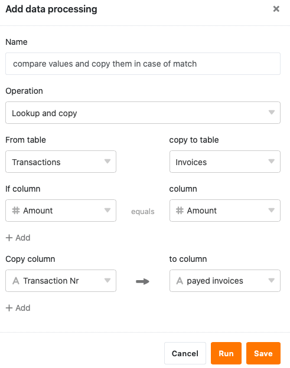
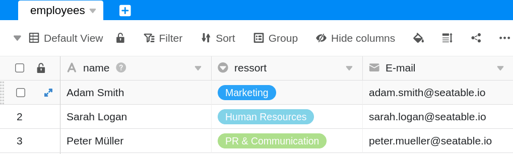

La fonction de traitement des données vous permet d'effectuer diverses opérations sur une colonne. **Comparer et copier** est une opération qui vous permet de copier les valeurs d'une colonne d'une table dans la colonne d'une autre table, à condition qu'une certaine valeur de comparaison soit identique dans les deux enregistrements.

## Mise en place de l'opération

1. Ouvrez n'importe quel **tableau** et cliquez sur les **trois points** dans les options d'affichage.
2. Cliquez sur **Traitement des données**, puis sur **Ajouter une opération de traitement des données**.
3. Donnez un **nom** à l'opération et sélectionnez **Comparer et copier**.

5. Définissez **de quelle table** proviennent les données et **dans quelle table** vous souhaitez copier les données.
6. Définissez une ou plusieurs **conditions** dans lesquelles deux colonnes des tableaux comparés doivent avoir une valeur identique pour que l'opération soit exécutée.
7. Sélectionnez une ou plusieurs **colonnes sources** à partir desquelles les valeurs seront copiées dans des **colonnes de résultats** à définir également, pour autant que les conditions de correspondance que vous avez définies soient remplies.



11. Cliquez sur **Enregistrer** pour sauvegarder l'action et l'exécuter plus tard, ou sur **Exécuter** pour l'exécuter directement.

Lors de la première exécution réussie, une petite icône apparaît dans la marge inférieure gauche. **crochet vert**.  

## Cas d'utilisation

Un cas concret d'utilisation de cette opération de traitement des données pourrait par exemple se présenter si vous gérez les **données des collaborateurs** de votre équipe dans une table et souhaitez créer les **tâches de votre équipe** qui doivent encore être effectuées dans une nouvelle table. En ajoutant une colonne avec les **noms** des collaborateurs responsables de chaque tâche, vous souhaitez créer une correspondance entre les tables.

Ensuite, vous souhaitez que certaines données des collaborateurs, qui existent déjà dans le tableau des collaborateurs, soient copiées dans le tableau des tâches. Par exemple, vous pourriez aussi avoir besoin de l'**adresse e-mail** pour pouvoir contacter directement la personne responsable.

Pour mettre en œuvre cette opération de traitement des données, vous avez besoin de **deux tables dans la même base**. Dans la première table, vous gérez les **données des employés**, qui comprennent entre autres les **adresses e-mail** des employés.

Dans le deuxième tableau, vous saisissez les **tâches ouvertes**, pour lesquelles le collaborateur responsable est saisi dans une autre colonne. En outre, vous créez une nouvelle colonne de type [e-mail](https://seatable.io/fr/docs/text-und-zahlen/die-e-mail-spalte-und-ihre-verwendung/), dans laquelle les adresses e-mail seront copiées ultérieurement.

Pour créer l'opération de traitement des données, suivez les étapes décrites ci-dessus. Pour le cas d'application concret, sélectionnez comme **condition** que le nom d'un collaborateur dans la colonne **name** de la table **employees** doit correspondre au nom dans la colonne **responsible** de la table **open tasks**. Cette étape est essentielle pour que les données correctes des collaborateurs concernés soient copiées lors de l'opération de traitement des données.



Dans l'étape suivante, vous pouvez sélectionner un nombre quelconque de colonnes sources dans la table **employees**, dont le contenu sera copié dans les colonnes de résultats sélectionnées de la table **open tasks** lorsque l'opération sera exécutée et que la condition de concordance que vous venez de définir sera remplie.

{{< warning  headline="Attention à la perte de données"  text="Les colonnes source et résultat doivent avoir **le même type de colonne** afin de ne pas perdre de données lors de la copie. Vous pouvez par exemple copier des données d'une [colonne de date](https://seatable.io/fr/docs/datum-dauer-und-personen/die-datum-spalte/) dans une [colonne de texte](https://seatable.io/fr/docs/text-und-zahlen/die-spalten-text-und-formatierter-text/), mais elles ne conviennent plus pour les [calendriers](https://seatable.io/fr/docs/plugins/anleitung-zum-kalender-plugin/). Avant d'effectuer l'opération, créez donc une **colonne de résultats** du même type dans le tableau cible pour chaque **colonne source** que vous souhaitez copier." />}}

Si l'opération est exécutée avec succès, les tables **employees** et **open tasks** sont examinées pour voir si les colonnes **name** et **responsible** définies correspondent. Si les **noms** dans les colonnes des deux tables correspondent, l'**adresse e-mail** de l'employé correspondant est automatiquement copiée de la colonne **E-mail** définie dans la colonne de résultat **contact**.



## Types de colonnes non pris en charge

Les types de colonnes suivants ne peuvent **pas** être copiés à l'aide de l'opération _Comparer et copier_ et ne sont donc **pas** disponibles lors de la définition des colonnes source et résultat.

- [Colonne à choix multiples](https://seatable.io/fr/docs/auswahlspalten/die-mehrfachauswahl-spalte/)
- [La colonne Créateur](https://seatable.io/fr/docs/datum-dauer-und-personen/die-spalten-ersteller-und-erstellt/)
- [La colonne Créé](https://seatable.io/fr/docs/datum-dauer-und-personen/die-spalten-ersteller-und-erstellt/)
- [La colonne Dernier intervenant](https://seatable.io/fr/docs/datum-dauer-und-personen/die-spalten-letzter-bearbeiter-und-zuletzt-bearbeitet/)
- [La colonne Récent](https://seatable.io/fr/docs/datum-dauer-und-personen/die-spalten-letzter-bearbeiter-und-zuletzt-bearbeitet/)
- [Bouton](https://seatable.io/fr/docs/andere-spalten/die-schaltflaeche/)
