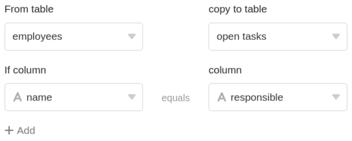

É possível utilizar a função de processamento de dados para executar várias operações em uma coluna. **Comparar e copiar** é uma operação com a qual é possível copiar os valores de uma coluna de uma tabela para a coluna de outra tabela, desde que um determinado valor de comparação seja idêntico em ambos os registos de dados.

## Pôr em prática a operação

1. Abrir qualquer **tabela** e clicar nos **três pontos** das opções de visualização.
2. Clique em **Data Processing** e depois em **Add Data Processing Operation**.
3. Dar um **nome** à operação e seleccionar **Comparar e Copiar**.

5. Definir de **que tabela** provêm os dados e **em que tabela** pretende copiar os dados.
6. Definir uma ou mais **condições** em que duas colunas das tabelas comparadas devem ter um valor idêntico para a operação a ser realizada.
7. Seleccionar uma ou mais **colunas de origem** das quais os valores serão copiados para **colunas de resultados** que também precisam de ser definidas, desde que as condições de correspondência que definir sejam cumpridas.



11. Clique em **Guardar para** guardar a acção e executá-la mais tarde, ou em **Executar** para executar a acção directamente.

A primeira vez que é executado com sucesso, um pequeno **carrapato verde**.  

## Estojo de utilização

Um caso concreto de utilização para esta operação de processamento de dados pode ocorrer, por exemplo, se mantiver os **dados dos funcionários** da sua equipa numa tabela e quiser criar as **tarefas da sua equipa** que ainda precisam de ser completadas numa nova tabela. Ao adicionar uma coluna com os **nomes dos** funcionários responsáveis pelas respectivas tarefas, pretende criar uma correspondência entre as tabelas.

Subsequentemente, pretende que certos dados dos empregados, que já existem na tabela de empregados, sejam copiados para a tabela de tarefas. Por exemplo, poderá também precisar do **endereço de correio electrónico** para poder contactar directamente a pessoa responsável.

Para implementar esta operação de processamento de dados, são necessárias **duas tabelas na mesma base**. Na primeira tabela, os **dados do pessoal** são mantidos, o que inclui, entre outras coisas, os **endereços de correio electrónico** do pessoal.

Na segunda tabela são introduzidas as **tarefas em aberto**, para as quais o respectivo funcionário responsável é introduzido noutra coluna. Além disso, cria-se uma nova coluna do tipo [e-mail](), para a qual os endereços de e-mail devem ser copiados mais tarde.

Para criar a operação de processamento de dados, seguir os passos descritos acima. Para o caso de utilização específica, seleccionar como **condição** que o **nome** de um funcionário na coluna do nome da tabela de **funcionários** deve corresponder ao nome na coluna **responsável** da tabela de **tarefas em aberto**. Esta etapa é essencial para que os dados correctos dos funcionários correspondentes sejam copiados durante a operação de processamento de dados.



No passo seguinte, pode seleccionar qualquer número de colunas de origem da tabela de **funcionários**, cujo conteúdo será copiado para as colunas de resultados seleccionados da tabela de **tarefas em aberto** quando a operação for executada e a justa condição de correspondência definida for verdadeira.



As colunas de origem e resultado devem ter **o mesmo tipo de coluna** para que não se percam dados quando se copia. Pode-se, por exemplo, copiar dados de uma [coluna de data]() para uma [coluna de texto](), mas estes já não são adequados para [calendários](). Portanto, antes de realizar a operação, crie uma coluna de **resultados** do mesmo tipo na tabela de destino para cada coluna de **origem** que pretende copiar.



Se a operação for executada com sucesso, as tabelas de **funcionários** e **tarefas em aberto** são verificadas quanto à correspondência no **nome das** colunas definidas e **responsáveis**. Se os **nomes** nas colunas de ambas as tabelas corresponderem, o **endereço de e-mail do** funcionário correspondente é automaticamente copiado do **e-mail** da coluna definida para o **contacto da** coluna de resultados.



## Tipos de colunas não suportados

Os seguintes tipos de colunas **não podem** ser copiados através da operação _Comparar e copiar_ e, portanto, **não** estão disponíveis ao definir as colunas de origem e de resultado.

- [Coluna de selecção múltipla]()
- [A coluna do Criador]()
- [A coluna do último editor]()
- [Botão]()
