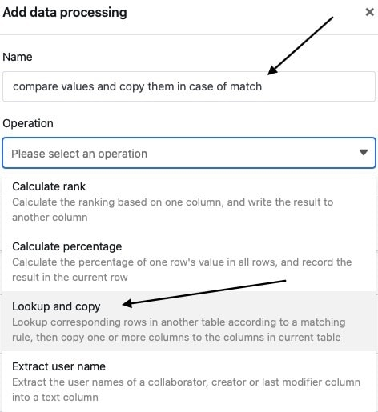
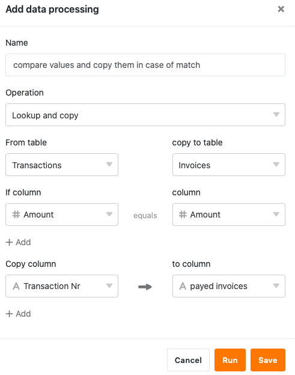
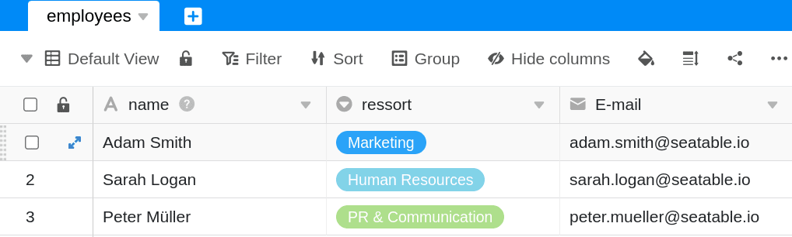
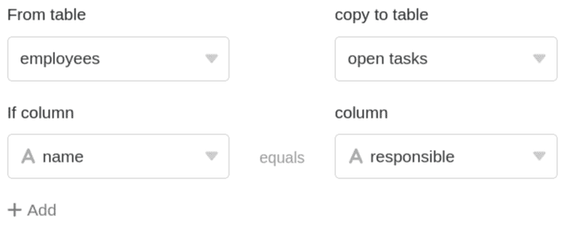

С помощью функции обработки данных можно выполнять различные операции над столбцом. **Сравнение и копирование** - это операция, с помощью которой можно скопировать значения столбца из одной таблицы в столбец другой таблицы при условии, что определенное значение сравнения совпадает в обеих записях данных.

## Проведение операции

1. Откройте любую **таблицу** и нажмите на **три точки** в опциях просмотра.
2. Нажмите на **Обработка данных**, а затем на **Добавить операцию обработки данных**.
3. Дайте **название** операции и выберите **Сравнить и скопировать**.

5. Определите, из **какой таблицы** поступают данные и **в какую таблицу** вы хотите скопировать данные.
6. Задайте одно или несколько **условий**, при которых два столбца сравниваемых таблиц должны иметь одинаковое значение, чтобы операция была выполнена.
7. Выберите один или несколько **столбцов-источников**, значения из которых будут скопированы в **столбцы-результаты**, которые также должны быть определены, при соблюдении заданных вами условий соответствия.



11. Нажмите на кнопку **Сохранить, чтобы** сохранить действие и выполнить его позже, или на кнопку **Выполнить**, чтобы выполнить действие напрямую.

В первый раз, когда он успешно выполняется, небольшой **зелёный клещ**.  

## Пример использования

Конкретный случай использования этой операции обработки данных может возникнуть, например, если вы храните **данные сотрудников** вашей команды в одной таблице и хотите создать **задачи вашей команды**, которые еще должны быть выполнены, в новой таблице. Добавив столбец с **именами** сотрудников, ответственных за соответствующие задачи, вы хотите создать соответствие между таблицами.

Впоследствии вы хотите, чтобы определенные данные сотрудников, которые уже существуют в таблице сотрудников, были скопированы в таблицу задач. Например, вам может понадобиться **адрес электронной почты**, чтобы иметь возможность напрямую связаться с ответственным лицом.

Для реализации этой операции обработки данных вам нужны **две таблицы в одной базе**. В первой таблице хранятся **данные о сотрудниках**, которые включают, помимо прочего, **адреса электронной почты** сотрудников.

Во второй таблице вводятся **открытые задачи**, для которых в другой колонке вводится соответствующий ответственный сотрудник. Кроме того, создается новый столбец типа [e-mail](), в который впоследствии будут копироваться адреса электронной почты.

Чтобы создать операцию обработки данных, выполните описанные выше действия. Для конкретного случая использования выберите в качестве **условия**, что **имя** сотрудника в столбце "Имя" в таблице " **Сотрудники** " должно совпадать с именем в столбце " **Ответственный** " в таблице " **Открытые задачи** ". Этот шаг необходим для того, чтобы во время операции обработки данных были скопированы правильные данные соответствующих сотрудников.



На следующем этапе вы можете выбрать любое количество исходных столбцов из таблицы **сотрудников**, содержимое которых будет скопировано в выбранные столбцы результатов **открытой** таблицы **задач**, когда операция будет выполнена и только что определенное условие совпадения будет истинным.



Колонки источника и результата должны иметь **одинаковый тип колонок**, чтобы данные не были потеряны при копировании. Например, можно скопировать данные из [столбца даты]() в [текстовый столбец](), но тогда они уже не будут подходить для [календарей](). Поэтому перед выполнением операции создайте в целевой таблице столбец **результата** того же типа для каждого столбца **источника**, который вы хотите скопировать.



Если операция выполнена успешно, таблицы **сотрудники** и **открытые задания** проверяются на совпадение в определенных столбцах **имя** и **ответственный**. Если **имена** в столбцах обеих таблиц совпадают, **адрес электронной почты** соответствующего сотрудника автоматически копируется из определенного столбца **email** в результирующий столбец **contact**.



## Типы столбцов не поддерживаются

Следующие типы столбцов **не могут** быть скопированы с помощью операции _сравнения и копирования_ и поэтому **недоступны** при определении столбцов источника и результата.

- [Колонка множественного выбора]()
- [Колонка "Создатель]()
- [Колонка "Последний редактор]()
- [Кнопка]()
