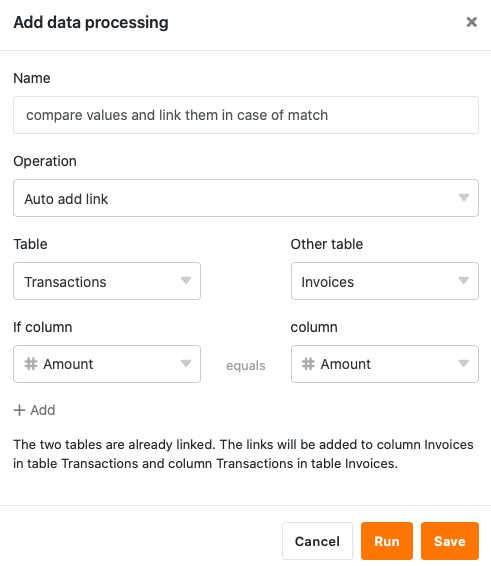
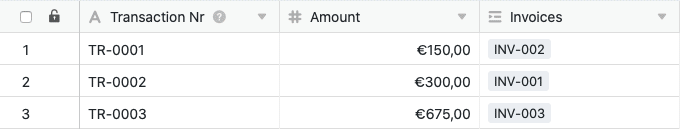

Using the data processing function, you can perform various operations across a column. **Compare and link** is an operation that allows you to link records in two different tables when a column value in both tables is identical.

## Putting on the operation

1. Open any **table** and click the **three dots** in the view options.
2. Click **Data Processing**, and then click **Add Data Processing Operation**.
3. Give the operation a **name** and select **Compare and Link**.

5. Define **two tables** you want to compare and link, and in which **columns** the values must match for SeaTable to link the records.



9. Click **Save to** save the action and execute it later, or **Execute** to execute the action directly.

On the first successful execution, a small **Green hook**.  

## Use case

A concrete use case for this data processing operation could occur, for example, if you work in the accounting department of a company and record in two tables, on the one hand, the **invoices** and, on the other hand, the **transactions** performed.

Here you want a **link to** be created between these tables when the invoice amount in one table matches the remittance amount in the other table. Using the linking you can easily link the related records so that the invoices are assigned to the remittances and the remittances are assigned to the invoices.

For the implementation, you first need two tables: a table in which the invoice numbers**(Invoice Nr**) and amounts are recorded, and a table with the transaction numbers**(Transaction Nr**) and amounts**(Amount**).



This data processing operation does **not** require you to add **columns** to your tables manually, as a [join column]() is automatically created in both tables when it is first executed.



To create the data processing operation, follow the steps described above. For the specific use case, select the _Transactions_ and _Invoices_ **tables** and the **Amount** \_columns_with the respective amounts that must match in order to link the records.

If executed successfully, the _Transactions_ and _Invoices_ tables are checked for matches in the defined _Amount columns_. If the **amounts** in these columns match, a **link** is created between the two **tables**.

In this case, a link to the corresponding **transaction** from the _Transactions_ table is added to one side of the corresponding **invoice** in the _Invoices_ table.

On the other hand, a link to the corresponding **invoice** from the _Invoices_ table is added to the corresponding **transaction** in the _Transactions_ table at the same time.

