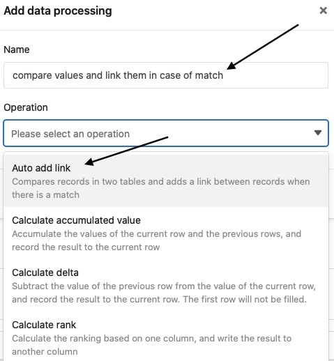
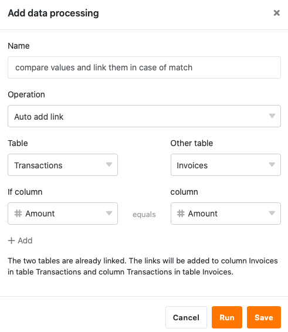
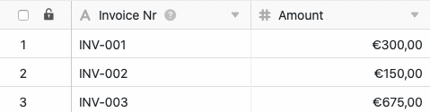
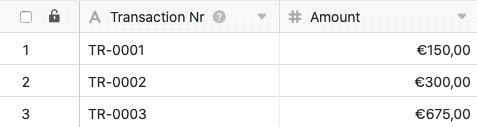
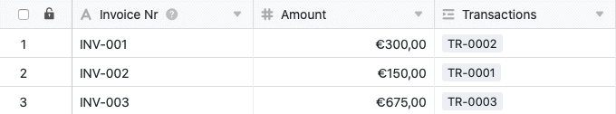
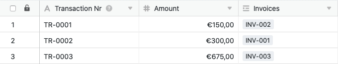

Mediante la función de tratamiento de datos, puede realizar diversas operaciones con una columna. **Comparar y vincular** es una operación que permite vincular registros de dos tablas diferentes si el valor de una columna de ambas tablas es idéntico.

## Puesta en marcha de la operación

1. Abra cualquier **tabla** y haga clic en los **tres puntos** de las opciones de vista.
2. Haga clic en **Proceso de datos** y luego en **Añadir operación de proceso de** datos.
3. Asigne un **nombre** a la operación y seleccione **Comparar y vincular**.

5. Defina **dos tablas** que desee comparar y vincular, y en qué **columnas** deben coincidir los valores para que SeaTable vincule los registros.



9. Haga clic en **Guardar para** guardar la acción y ejecutarla más tarde, o en **Ejecutar** para ejecutar la acción directamente.

La primera vez que se ejecuta con éxito, un pequeño **garrapata verde**.  

## Caso práctico

Un caso de uso concreto de esta operación de tratamiento de datos podría darse, por ejemplo, si trabajas en el departamento de contabilidad de una empresa y registras en dos tablas por un lado las **facturas** y por otro las **transacciones** realizadas.

Aquí desea **que** se cree un enlace entre estas tablas cuando el importe de la factura en una tabla coincida con el importe de la transferencia en la otra tabla. Con la vinculación puede vincular fácilmente los registros relacionados de forma que las facturas se asignen a las transferencias y las transferencias se asignen a las facturas.

Para la implementación, primero necesita dos tablas: una tabla en la que se registren los números de factura (**Invoice\*\***Nr**) y los importes, y una tabla con los números de transacción**(Transaction Nr**) y los importes**(Amount\*\*).



Con esta operación de tratamiento de datos, **no** es necesario añadir **columnas** a las tablas manualmente, ya que se crea automáticamente una [columna de enlace]() en ambas tablas la primera vez que se ejecuta.



Para crear la operación de tratamiento de datos, siga los pasos descritos anteriormente. Para el caso de uso específico, seleccione las **tablas** _Transacciones_ y _Facturas_ y las _columnas_**Importe** con los importes respectivos que deben coincidir para que los registros se vinculen.

Si se ejecuta correctamente, se comprueba si las tablas _Transacciones_ y _Facturas_ coinciden en las _columnas_ de importe definidas. Si los **importes** de estas columnas coinciden, se crea un **enlace** entre las dos **tablas**.

En este caso, se añade un enlace a la **transacción** correspondiente de la tabla _Transacciones_ a un lado de la **factura** correspondiente en la tabla _Facturas_.

Por otra parte, se añade al mismo tiempo un enlace a la **factura** correspondiente de la tabla _Facturas_ a la **transacción** correspondiente de la tabla _Transacciones_.

