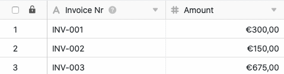

La fonction de traitement des données vous permet d'effectuer diverses opérations sur une colonne. **Comparer et lier** est une opération qui vous permet de lier des enregistrements dans deux tableaux différents si une valeur de colonne est identique dans les deux tableaux.

## Mise en place de l'opération

1. Ouvrez n'importe quel **tableau** et cliquez sur les **trois points** dans les options d'affichage.
2. Cliquez sur **Traitement des données**, puis sur **Ajouter une opération de traitement des données**.
3. Donnez un **nom** à l'opération et sélectionnez **Comparer et lier**.

5. Définissez **deux tableaux** que vous souhaitez comparer et lier, et dans quelles **colonnes** les valeurs doivent correspondre pour que SeaTable relie les enregistrements entre eux.



9. Cliquez sur **Enregistrer** pour sauvegarder l'action et l'exécuter plus tard, ou sur **Exécuter** pour l'exécuter directement.

Lors de la première exécution réussie, une petite icône apparaît dans la marge inférieure gauche. **crochet vert**.  

## Cas d'utilisation

Un cas d'application concret de cette opération de traitement des données pourrait par exemple se présenter si vous travaillez à la comptabilité d'une entreprise et que vous saisissez dans deux tableaux d'une part les **factures** et d'autre part les **transactions** effectuées.

Vous souhaitez qu'un **lien** soit **établi** entre ces tableaux lorsque le montant de la facture dans un tableau correspond au montant du virement dans l'autre tableau. Ce lien vous permet de relier facilement les enregistrements associés, de sorte que les factures soient associées aux virements et les virements aux factures.

Pour la mise en œuvre, vous avez tout d'abord besoin de deux tableaux : un tableau dans lequel les numéros de facture**(Invoice Nr**) et les montants sont saisis, et un tableau avec les numéros de transaction**(Transaction Nr**) et les montants**(Amount**).



Avec cette opération de traitement des données, vous n'avez **pas** besoin d'ajouter manuellement **des colonnes** à vos tableaux, car une [colonne de liaison]() est automatiquement créée dans les deux tableaux lors de la première exécution.



Pour créer l'opération de traitement des données, suivez les étapes décrites ci-dessus. Pour le cas d'application concret, sélectionnez les **tableaux** _Transactions_ et _Invoices_ ainsi que les _colonnes_**Amount** avec les montants respectifs qui doivent correspondre pour que les enregistrements soient reliés entre eux.

Si l'exécution est réussie, les tableaux _Transactions_ et _Factures_ sont analysées pour voir si elles correspondent dans les _colonnes de montants_ définies. Si les **montants** dans ces colonnes correspondent, un **lien** est établi entre les deux **tableaux**.

Dans ce cas, un lien avec la **transaction** correspondante du tableau _Transactions_ est ajouté d'un côté de la **facture** correspondante dans le tableau _Invoices_.

D'autre part, un lien est simultanément ajouté à la **transaction** correspondante dans le tableau _Transactions_ avec la **facture** correspondante du tableau _Invoices_.

