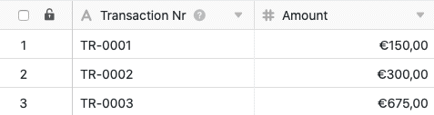

Usando a função de processamento de dados, é possível realizar várias operações através de uma coluna. **Comparar e ligar** é uma operação que lhe permite ligar registos em duas tabelas diferentes se um valor de coluna em ambas as tabelas for idêntico.

## Pôr em prática a operação

1. Abrir qualquer **tabela** e clicar nos **três pontos** das opções de visualização.
2. Clique em **Data Processing** e depois em **Add Data Processing Operation**.
3. Dar um **nome** à operação e seleccionar **Comparar e Ligar**.

5. Defina **duas tabelas** que deseja comparar e ligar, e em que **colunas** os valores devem corresponder para que o SeaTable ligue os registos.



9. Clique em **Guardar para** guardar a acção e executá-la mais tarde, ou em **Executar** para executar a acção directamente.

A primeira vez que é executado com sucesso, um pequeno **carrapato verde**.  

## Estojo de utilização

Um caso concreto de utilização para esta operação de processamento de dados poderá ocorrer, por exemplo, se trabalhar no departamento de contabilidade de uma empresa e registar em dois quadros, por um lado, as **facturas** e, por outro lado, as **transacções** efectuadas.

Aqui pretende que seja criada uma **ligação** entre estas tabelas quando o montante da factura numa tabela corresponder ao montante da remessa na outra tabela. Com a ligação pode facilmente ligar os registos relacionados de modo a que as facturas sejam atribuídas às transferências e as transferências sejam atribuídas às facturas.

Para a implementação, são necessárias duas tabelas: uma tabela na qual são registados os números das facturas**(Nº de facturação**) e os montantes, e uma tabela com os números das transacções**(Nº de transacção**) e os montantes**(Montante**).



Para criar a operação de processamento de dados, seguir os passos descritos acima. Para o caso de utilização específica, seleccionar as **tabelas de** _Transacções_ e _Facturas_ e as _colunas_**Montante** com os respectivos montantes que devem corresponder para que os registos possam ser ligados.

Se executadas com sucesso, as tabelas de _Transacções_ e _Facturas_ são verificadas quanto à correspondência nas _colunas de montantes_ definidos. Se os **montantes** nestas colunas corresponderem, é criada uma **ligação** entre as duas **tabelas**.

Neste caso, uma ligação à **transacção** correspondente da tabela _Transacções_ é adicionada a um dos lados da **factura** correspondente da tabela _Facturas_.

Por outro lado, uma ligação à **factura** correspondente da tabela de _Facturas_ é adicionada à **transacção** correspondente da tabela de _Transacções_, ao mesmo tempo.

