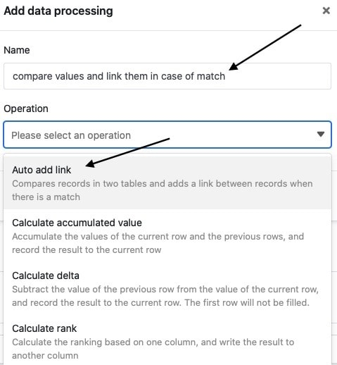

Функция обработки данных позволяет выполнять различные операции над столбцом. **Сравнение и связь** - это операция, которая позволяет связать записи в двух разных таблицах, если значение столбца в обеих таблицах одинаково.

## Проведение операции

1. Откройте любую **таблицу** и нажмите на **три точки** в опциях просмотра.
2. Нажмите на **Обработка данных**, а затем на **Добавить операцию обработки данных**.
3. Дайте **название** операции и выберите **Сравнить и связать**.

5. Определите **две таблицы**, которые вы хотите сравнить и связать, и в каких **столбцах** значения должны совпадать, чтобы SeaTable связал записи.



9. Нажмите на кнопку **Сохранить, чтобы** сохранить действие и выполнить его позже, или на кнопку **Выполнить**, чтобы выполнить действие напрямую.

В первый раз, когда он успешно выполняется, небольшой **зелёный клещ**.  

## Пример использования

Конкретный случай использования этой операции по обработке данных может иметь место, например, если вы работаете в бухгалтерии компании и записываете в две таблицы, с одной стороны, **счета-фактуры**, а с другой - проведенные **операции**.

Здесь вы хотите, чтобы между этими таблицами создавалась **связь**, когда сумма счета в одной таблице совпадает с суммой перевода в другой таблице. С помощью связи вы можете легко связать связанные записи так, чтобы счета-фактуры были отнесены к переводам, а переводы - к счетам-фактурам.

Для реализации вам сначала понадобятся две таблицы: одна таблица, в которой записываются номера счетов**(Invoice Nr**) и суммы, и одна таблица с номерами транзакций**(Transaction Nr**) и суммами**(Amount**).



При использовании этой операции обработки данных вам **не** придется добавлять **столбцы** в таблицы вручную, так как при первом ее выполнении в обеих таблицах автоматически создается [столбец связи]().



Чтобы создать операцию обработки данных, выполните описанные выше шаги. Для конкретного случая использования выберите **таблицы** _Транзакции_ и _Счета-фактуры_ и _столбцы_**Сумма** с соответствующими суммами, которые должны совпадать для того, чтобы записи были связаны.

При успешном выполнении таблицы _"Операции"_ и " _Счета-фактуры"_ проверяются на совпадение в определенных _столбцах сумм_. Если **суммы** в этих столбцах совпадают, между двумя **таблицами** создается **связь**.

В этом случае ссылка на соответствующую **транзакцию** из таблицы _Transactions_ добавляется к одной стороне соответствующего **счета** в таблице _Invoices_.

С другой стороны, ссылка на соответствующий **счет-фактуру** из таблицы _Счета-фактуры_ одновременно добавляется к соответствующей **транзакции** в таблице _Транзакции_.

