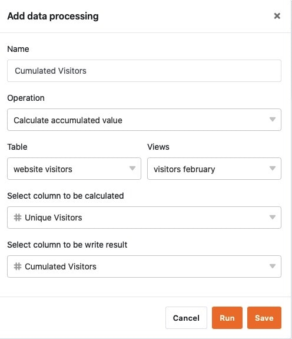

Mithilfe der Datenverarbeitungsfunktion können Sie diverse **Operationen** durchführen. Dabei können Sie sowohl mathematische Berechnungen über alle Werte einer Spalte hinweg vornehmen als auch Werte miteinander in Beziehung setzen, wenn Einträge in zwei verschiedenen Tabellen identisch sind.

Datenverarbeitungsoperationen können Sie jederzeit über die Ansichtsoptionen in Ihren Tabellen anlegen. Die Ergebnisse einer Operation speichern Sie einfach in einer zusätzlichen Spalte.

## Anlegen einer Datenverarbeitungsoperation

1. Öffnen Sie eine beliebige **Tabelle**, für die Sie eine Datenverarbeitungsoperation anlegen möchten.
2. Klicken Sie auf die **drei Punkte** in den Ansichtsoptionen.
3. Klicken Sie auf **Datenverarbeitung** und im Anschluss auf **Datenverarbeitungsoperation hinzufügen**.
4. Geben Sie der Operation einen **Namen**.
5. Wählen Sie eine **Operation** aus.
6. Definieren Sie je nach Operation **Tabelle**, **Ansicht**, **Quellspalte** und **Ergebnisspalte** bzw. die zu vergleichenden Tabellen und Spalten.
7. Klicken Sie auf **Speichern**, um die Operation zu speichern und später auszuführen, oder auf **Ausführen**, um die Operation direkt zu starten.
   

## Datenverarbeitungsoperationen

Derzeit stehen Ihnen folgende Operationen zur Verfügung:

- Kumulierte Werte berechnen
- Rangliste berechnen
- Veränderungen berechnen
- Prozentualen Anteil berechnen
- Vergleichen und verknüpfen
- Vergleichen und kopieren
- Benutzernamen übertragen

## Voraussetzungen

Für das Anlegen einer Datenverarbeitungsoperation gibt es je nach Operation **unterschiedliche Voraussetzungen**.

Für mathematische Berechnungen, d.h. für die Operationen **Kumulierte Werte berechnen**, **Rangliste berechnen**, **Veränderungen berechnen** und **Prozentualen Anteil berechnen**, benötigen Sie mindestens **zwei** [Zahlen-Spalten]() in der ausgewählten Tabellenansicht. In der Regel ist die **Quellspalte** bereits vorhanden und mit Daten gefüllt, wohingegen Sie die **Ergebnisspalte** neu anlegen und durch die Operation mit Werten füllen.

Für die übrigen Operationen brauchen Sie zum Teil [Verknüpfungsspalten]() (**Vergleichen und verknüpfen** & **Vergleichen und kopieren**) oder [Text-Spalten]() (**Benutzername übertragen**).
