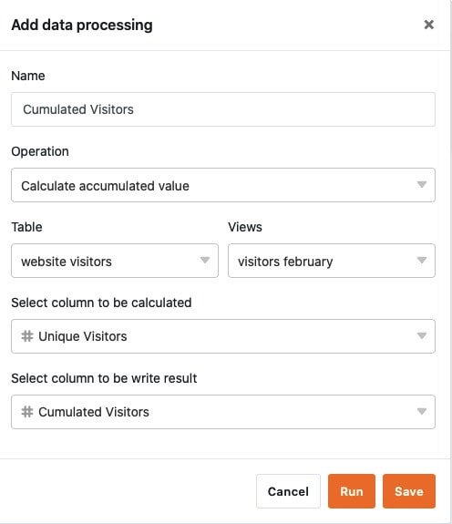

You can perform various **operations** using the data processing function. You can perform mathematical calculations across all values in a column, as well as correlate values when entries in two different tables are identical.

You can create data processing operations at any time using the view options in your tables. You simply store the results of an operation in an additional column.

## Creating a data processing operation

1. Open any **table** for which you want to create a data processing operation.
2. Click on the **three dots** in the view options.
3. Click **Data Processing**, and then click **Add Data Processing Operation**.
4. Give the operation a **name**.
5. Select an **operation**.
6. Depending on the operation, define the **table**, **view**, **source column** and **result column** or the tables and columns to be compared.
7. Click **Save to** save the operation and run it later, or **Run** to start the operation directly.

## Data processing operations

Currently, the following operations are available to you:

- Calculate cumulative values
- Calculate ranking
- Calculate changes
- Calculate percentage
- Compare and link
- Compare and copy
- Transfer user name

## Requirements

There are **different requirements for** creating a data processing operation depending on the operation.

For mathematical calculations, i.e. for the operations **Calculate cumulative values**, Calculate **ranking**, Calculate **changes** and Calculate **percentage**, you need at least **two** [number columns](https://seatable.io/en/docs/text-und-zahlen/die-zahlen-spalte/) in the selected table view. Usually, the **source column** already exists and is filled with data, whereas you create the **result column** and fill it with values through the operation.

For the other operations you need partly [link columns](https://seatable.io/en/docs/verknuepfungen/wie-man-tabellen-in-seatable-miteinander-verknuepft/)**(compare and link** & **compare and copy**) or [text columns](https://seatable.io/en/docs/text-und-zahlen/die-spalten-text-und-formatierter-text/)**(transfer user name**).
