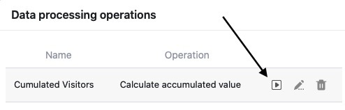

Mithilfe der Datenverarbeitungsfunktion können Sie diverse **Operationen** durchführen. Dabei können Sie sowohl mathematische Berechnungen über alle Werte einer Spalte hinweg vornehmen als auch Werte miteinander in Beziehung setzen, wenn Einträge in zwei verschiedenen Tabellen identisch sind.

Datenverarbeitungsoperationen führen Sie entweder **manuell** oder **per Automation** aus. Wie genau die manuelle Ausführung funktioniert, erfahren Sie in diesem Artikel. Ausführliche Informationen zur Ausführung per Automation finden Sie [hier](https://seatable.io/docs/beispiel-automationen/datenverarbeitungsoperation-per-automation-ausfuehren/).

## Ausführung einer Datenverarbeitungsoperation

1. Öffnen Sie eine beliebige **Tabelle**, in der Sie eine Datenverarbeitungsoperation ausführen möchten.
2. Klicken Sie auf die **drei Punkte** in den Ansichtsoptionen.
3. Klicken Sie auf **Datenverarbeitung**.
4. Fahren Sie mit der Maus über eine bereits angelegte **Datenverarbeitungsoperation**, die Sie ausführen möchten.
5. Klicken Sie auf das **Play-Symbol**.
   7. Nach erfolgreicher Ausführung erscheint anstelle des Play-Symbols ein **grüner Haken**.
   



## Folgen der Ausführung

Bei jeder Ausführung der Datenverarbeitungsoperation werden die **Ergebnisse** ohne Rücksicht auf Verluste in die **Ergebnisspalte** geschrieben. Wenn Sie keine Daten überschreiben wollen, sollten Sie für die Ergebnisse im Voraus eine [neue leere Spalte anlegen]().

Im Gegensatz zu **Formel-Spalten**, die permanent die beteiligten Spalten überwachen, aktualisieren sich die **Ergebnisspalten** nicht von selbst. Änderungen der Werte in der Quellspalte wirken sich ohne [Automation](https://seatable.io/docs/beispiel-automationen/datenverarbeitungsoperation-per-automation-ausfuehren/) oder erneute Ausführung nicht auf die Werte in der Ergebnisspalte aus.

Um Missverständnissen vorzubeugen, empfehlen wir daher, **keine** manuellen Änderungen an den beteiligten Spalten vorzunehmen und diese nach der Ausführung zur Sicherheit [für die Bearbeitung zu sperren]() (erfordert ein Plus- oder Enterprise-Abo).

Machen Sie sich klar, dass es sich bei den berechneten Werten um eine Momentaufnahme zum Zeitpunkt der Ausführung handelt. Wenn Sie die Operation nicht erneut ausführen, können die Ergebnisse veraltet sein, sofern sich in der Quellspalte inzwischen die Werte verändert haben.
