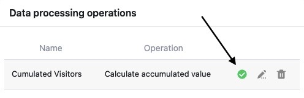

La fonction de traitement des données vous permet d'**effectuer** diverses **opérations**. Vous pouvez effectuer des calculs mathématiques sur toutes les valeurs d'une colonne ou établir une relation entre les valeurs si les entrées de deux tableaux différents sont identiques.

Les opérations de traitement des données s'effectuent soit **manuellement**, soit **par automatisation**. Vous apprendrez dans cet article comment fonctionne exactement l'exécution manuelle. Vous trouverez [ici]() des informations détaillées sur l'exécution par automation.

## Exécution d'une opération de traitement de données

1. Ouvrez n'importe quelle **table** dans laquelle vous souhaitez effectuer une opération de traitement des données.
2. Cliquez sur les **trois points** dans les options d'affichage.
3. Cliquez sur **Traitement des données**.
4. Passez la souris sur une **opération de traitement de données** déjà créée que vous souhaitez exécuter.
5. Cliquez sur l'**icône de lecture**.

7. Une fois l'exécution réussie, une **coche verte** apparaît à la place de l'icône de lecture.



"Vous pouvez effectuer des opérations de traitement des données non seulement **manuellement**, mais aussi [par automatisation](). Si cela vous intéresse, lisez l'article lié à ce sujet.



## Conséquences de l'exécution

Chaque fois que l'opération de traitement des données est exécutée, les **résultats** sont écrits dans la **colonne des résultats** sans tenir compte des pertes. Si vous ne voulez pas écraser de données, vous devez [créer]() pour les résultats.

Contrairement aux **colonnes de formules** qui surveillent en permanence les colonnes impliquées, les **colonnes de résultats** ne s'actualisent pas d'elles-mêmes. Les modifications des valeurs dans la colonne source n'ont pas d'effet sur les valeurs dans la colonne de résultats sans [automatisation]() ou nouvelle exécution.

Pour éviter tout malentendu, nous recommandons donc de ne **pas** apporter de modifications manuelles aux colonnes impliquées et de les [bloquer]() après l'exécution, par mesure de sécurité (nécessite un abonnement Plus ou Enterprise).

N'oubliez pas que les valeurs calculées sont un instantané au moment de l'exécution. Si vous n'exécutez pas à nouveau l'opération, les résultats peuvent être obsolètes si les valeurs de la colonne source ont changé entre-temps.
