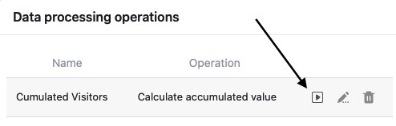
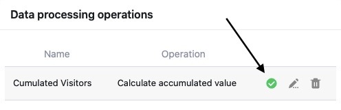
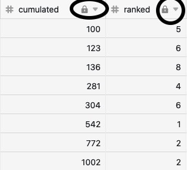

Com a ajuda da função de processamento de dados, é possível realizar várias **operações**. Pode efectuar cálculos matemáticos em todos os valores de uma coluna, bem como correlacionar valores quando as entradas em duas tabelas diferentes são idênticas.

As operações de processamento de dados são executadas **manualmente** ou **por automatização**. Este artigo explica exactamente como funciona a execução manual. Informações detalhadas sobre a execução via automação podem ser encontradas [aqui](https://seatable.io/pt/docs/beispiel-automationen/datenverarbeitungsoperation-per-automation-ausfuehren/).

## Execução de uma operação de tratamento de dados

1. Abra qualquer **tabela** em que deseje realizar uma operação de processamento de dados.
2. Clique nos **três pontos** nas opções de visualização.
3. Clique em **Processamento de dados**.
4. Passe o rato por cima de uma **operação de processamento de dados** já criada que pretende realizar.
5. Clique no **ícone de jogo**.

7. Após a execução bem sucedida, aparece uma **marca verde** em vez do símbolo de jogo.



## Consequências da execução

Cada vez que a operação de processamento de dados é executada, os **resultados** são escritos na **coluna de resultados** independentemente. Se não quiser sobregravar quaisquer dados, deve [criar]() para os resultados.

Ao contrário das colunas **de fórmulas**, que monitorizam permanentemente as colunas envolvidas, **as colunas de resultados** não se actualizam. As alterações nos valores da coluna de origem não afectam os valores da coluna de resultados sem [automatização](https://seatable.io/pt/docs/beispiel-automationen/datenverarbeitungsoperation-per-automation-ausfuehren/) ou reexecução.

Para evitar mal-entendidos, recomendamos portanto que **não** se façam quaisquer alterações manuais às colunas envolvidas e que se as [tranquem]() após a execução por motivos de segurança (requer uma assinatura Plus ou Enterprise).

Esteja ciente de que os valores calculados são uma fotografia instantânea no momento da execução. Se não reexecutar a operação, os resultados podem estar desactualizados se os valores na coluna da fonte tiverem mudado entretanto.
