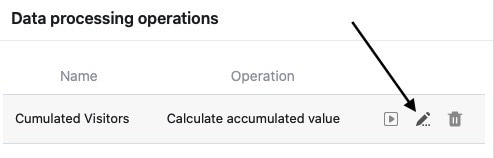

Com a ajuda da função de processamento de dados, é possível realizar várias **operações**. Pode efectuar cálculos matemáticos em todos os valores de uma coluna, bem como correlacionar valores quando as entradas em duas tabelas diferentes são idênticas.

Pode **editar** operações de processamento de dados que já tenham sido criadas em qualquer altura, utilizando as opções de visualização nas suas tabelas:

1. Abra qualquer **tabela** em que deseje editar uma operação de processamento de dados.
2. Clique nos **três pontos** nas opções de visualização.
3. Clique em **Processamento de dados**.
4. Mova o rato sobre uma operação de processamento de dados aplicada e clique no **ícone do lápis**.

6. Fazer os **ajustamentos** desejados **à** operação.
7. Clique em **Guardar para** guardar as suas alterações ou, em alternativa, em **Executar** para executar directamente a operação editada.
