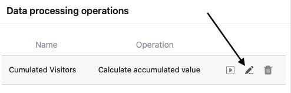

С помощью функции обработки данных можно выполнять различные **операции**. Вы можете выполнять математические вычисления по всем значениям в столбце, а также соотносить значения, когда записи в двух разных таблицах идентичны.

Вы можете в любое время **редактировать** уже созданные операции обработки данных, используя опции просмотра в таблицах:

1. Откройте любую **таблицу**, в которой вы хотите отредактировать операцию обработки данных.
2. Нажмите на **три точки** в опциях просмотра.
3. Нажмите на **Обработка данных**.
4. Наведите курсор мыши на применяемую операцию обработки данных и нажмите на **значок карандаша**.

6. Внесите необходимые **коррективы** в работу.
7. Нажмите на **Save (Сохранить), чтобы** сохранить изменения, или на **Execute (Выполнить**), чтобы непосредственно выполнить отредактированную операцию.
