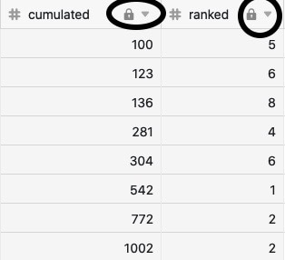

Die Datenverarbeitungsfunktion ist ein nützliches Feature von SeaTable, mit dem Sie **Operationen** in einer Spalte über mehrere Zeilen hinweg durchführen können. Durch die Definition einer Operation können Sie entweder diverse **mathematische Berechnungen** durchführen oder **Beziehungen zwischen Werten** in verschiedenen Tabellen herstellen. Datenverarbeitungsoperationen entfalten eine besonders große Wirkung in umfangreichen Datensätzen, in denen Sie eine hohe Anzahl an Rechenprozessen abwickeln können.

## Sinn hinter Datenverarbeitungsoperationen

SeaTable denkt oft in Zeilen. Zum Beispiel kann eine [Formel]() ausschließlich die Werte in einer Zeile miteinander in Beziehung setzen und auch [Verlinkungen zwischen Tabellen](https://seatable.io/docs/arbeiten-in-tabellen/tabellen-miteinander-verlinken/) erfolgen immer nur von Zeilen zu Zeilen.

Die Datenverarbeitung ist im Gegensatz dazu eine Funktion, um Operationen in einer Spalte über mehrere Zeilen hinweg durchzuführen. Grundsätzlich wird dabei zwischen zwei verschiedenen Arten von Datenverarbeitungsoperationen unterschieden:

- **Mathematische Berechnungen** über alle Werte in einer Spalte hinweg. Beispiel: Zugriffszahlen auf eine Webseite.
- **Werte in Beziehung setzen**, wenn sie in zwei Tabellen identisch sind. Beispiel: eingegangene Zahlungen einer Rechnung zuordnen.

## Mathematische und Beziehungs-Operationen

Folgende **mathematische Operationen** können derzeit mithilfe der Datenverarbeitungsfunktion durchgeführt werden:

- [Kumulierte Werte berechnen]()
- [Rangliste berechnen]()
- [Veränderungen berechnen]()
- [Prozentualen Anteil berechnen]()

Folgende **Beziehungs-Operationen** können derzeit mithilfe der Datenverarbeitungsfunktion durchgeführt werden:

- [Vergleichen und verknüpfen]()
- [Vergleichen und kopieren]()
- [Benutzernamen übertragen]()

## Voraussetzungen für die Definition der Operationen

Für beide Arten von Datenverarbeitungsoperationen gelten jeweils unterschiedliche **Voraussetzungen**, die erfüllt werden müssen, um eine entsprechende Operation anzulegen.

- **Mathematische Operationen** setzen das Vorhandensein von **zwei Zahlen-Spalten** in Ihrer Tabelle voraus.
- Für die **Beziehungs-Operationen** benötigen Sie je nach Anwendungsfall ganz bestimmte Spaltentypen, z. B. eine [Mitarbeiter-Spalte]() und eine [Text-Spalte]() beim Übertragen von Benutzernamen.

## Hinweise zur Ausführung

Datenverarbeitungsoperationen können derzeit [manuell]() oder [per Automation]() ausgeführt werden können.

Bei jeder Ausführung der Datenverarbeitungsoperation werden die **Ergebnisse** ohne Rücksicht auf Verluste in die **Ergebnisspalte** geschrieben. Wenn Sie keine Daten überschreiben wollen, sollten Sie für die Ergebnisse im Voraus eine [neue leere Spalte anlegen]().

Im Gegensatz zu **Formel-Spalten**, die permanent die beteiligten Spalten überwachen, aktualisieren sich die **Ergebnisspalten** _nicht_ von selbst. Änderungen der Werte in der Quellspalte wirken sich ohne [Automation](https://seatable.io/docs/beispiel-automationen/datenverarbeitungsoperation-per-automation-ausfuehren/) oder erneute Ausführung _nicht_ auf die Werte in der Ergebnisspalte aus. Deshalb können Sie die errechneten bzw. in Beziehung gesetzten Werte auch manuell überschreiben.

## Schutz vor Änderungen

Um Missverständnissen vorzubeugen, empfehlen wir, **keine manuellen Änderungen** an den beteiligten Spalten vorzunehmen und diese nach der Ausführung zur Sicherheit [für die Bearbeitung zu sperren]() (erfordert ein Plus- oder Enterprise-Abo).

Machen Sie sich klar, dass es sich bei den berechneten bzw. in Beziehung gesetzten Werten um eine **Momentaufnahme** zum Zeitpunkt der Ausführung handelt. Wenn Sie die Operation nicht erneut ausführen, können die Ergebnisse veraltet sein, sofern sich in der Quellspalte inzwischen die Werte verändert haben.
