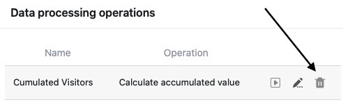

You can perform various **operations** using the data processing function. You can perform mathematical calculations across all values in a column, as well as correlate values when entries in two different tables are identical.

You can delete already created data processing operations at any time using the view options in your tables.

## Deleting a data processing operation

1. Open any **table** where you want to delete a data processing operation.
2. Click on the **three dots** in the view options.
3. Click on **Data Processing**.
4. Hover the mouse over the created data processing operation you want to delete and click the **trash can icon**.

## Consequences of deletion

If you delete a data processing operation that has been created, it is **irrevocably deleted** and consequently cannot **be restored**. However, the calculated or related values in the **results column of** your table will still be preserved.

Of course, you can **no** longer execute a deleted data processing operation, i.e. you can **no** longer consider entries added to the source column afterwards. However, if you want to work with the data processing operation in your table again at a later time, you can [create]() at any time.
