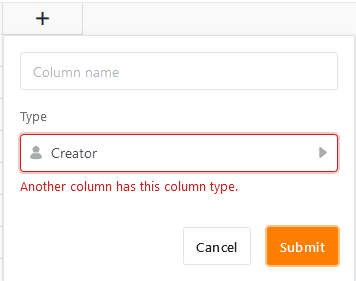

The columns **Creator** and **Creation date** are exclusively filled **automatically** by SeaTable and therefore represent special column types. While SeaTable fills the creator column with the **name of the user** who created row , the creation date column records the **time** (date and time) when the user created row .

## Special features of the two column types

- The automatically entered values in the Creator and Creation Date columns **cannot** be edited.
- When **creating the** two types of columns, **no** options are available, except for the column name.
- Only **one** creator and creation date column can be created per table. If you try to create another column of the same type, the message "Another column has this column type." appears.

- For this reason, you cannot **duplicate** creator and creation date columns **and customize their column type**.
