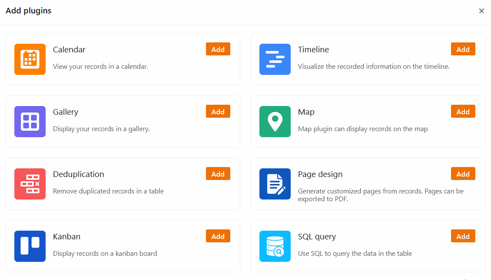

Dependendo da tarefa e dos dados recolhidos, diferentes **modos de visualização** são úteis para facilitar o seu trabalho no SeaTable. O SeaTable oferece-lhe vistas para este fim: Os dados quantitativos podem ser melhor registados na vista de tabela, estruturados com filtros, ordenação e agrupamento e avaliados com a ajuda de **estatísticas**.

Para os tipos alargados de dados que pode armazenar e organizar no SeaTable, existem vistas alargadas sob a forma de **plugins**. Para o planeamento temporal, por exemplo, a linha do tempo e o calendário são particularmente úteis. Para as fotografias, a galeria é útil, e para os dados geográficos, o mapa. Um quadro kanban faz sentido especialmente para o agrupamento de selecções individuais.

Neste artigo, aprenderá quais os pontos de vista e plugins disponíveis, como pode utilizá-los e para que casos de utilização são particularmente adequados.

## Vista de tabela

SeaTable tem uma **vista de tabela** para os casos de uso mais comum. Aqui os seus dados são registados numa tabela constituída por **linhas** e **colunas**. A vista de tabela é a **vista por defeito** do SeaTable: Quando abre uma base, vê os seus dados pela primeira vez em forma de tabela.

A visualização da tabela é essencial para a introdução, edição e gestão manual de dados numa base: Nela, cria-se as tabelas e define-se a estrutura das colunas. A cada coluna é atribuído um [tipo]() que regista determinados dados.

A visualização da tabela é particularmente adequada para exibir dados baseados em texto e números. Utilizando as configurações de visualização disponíveis, tais como [agrupamento, classificação e filtragem](), também é possível efectuar avaliações simples muito rapidamente.

É possível ver o número de linhas e os valores das colunas na [linha de estado]() em qualquer altura.

### Estatísticas

Utilize o módulo estatístico SeaTable para criar diagramas e visualizar números. Permite análises mais complexas do que é possível na vista de tabela. Oferece também uma vasta gama de opções de visualização gráfica com uma variedade de tipos de gráficos suportados.

Para obter informações completas sobre as opções de análise estatística, consulte as [instruções do módulo de estatística]().

## Vistas avançadas

Com a ajuda de **plug-ins**, a visualização da tabela pode ser complementada com outras opções de visualização. Estas ampliam os possíveis campos de aplicação da SeaTable para além da análise meramente quantitativa de dados numéricos - permitindo que a SeaTable seja utilizada para aplicações que não podem ser cobertas por uma folha de cálculo clássica.

Os plugins permitem-lhe ver os seus dados de diferentes ângulos. O conjunto de dados permanece sempre exactamente o mesmo, apenas a apresentação muda.

Activa-se os plugins através do gestor de plugins, que se abre através do botão **Plugins** no canto superior direito do cabeçalho da base. Pode descobrir [aqui](https://seatable.io/pt/docs/plugins/aktivieren-eines-plugins-in-einer-base/) como adicionar plugins à sua base. Os plugins só são activados para a base aberta. Poderá ter de activar os plugins de novo noutras bases.

Com o [plugin do calendário](), pode gerir imagens rápida e facilmente na sua Base.

Visualize endereços e dados de posição num mapa através do [plug-in do mapa]() e visualize as suas tarefas e fases do projecto com o [plug-in Kanban]() ajuda-o a transformar rapidamente os seus conjuntos de dados em documentos em layouted.
