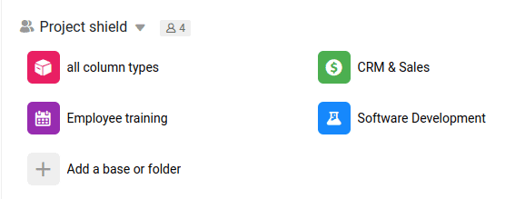

Each of the square icons on your Home page represents a **Base**. It is a database, comparable to a workbook in a conventional spreadsheet and can contain several **tables** on different topics.

A Base represents a self-contained **unit** in SeaTable. Therefore, it should contain all the information you need for a specific project or process.

For example, the base for your sales pipeline can contain separate tables for leads, companies, and business opportunities. Similarly, you can use a base for planning a wedding and then create separate tables for potential venues, attendees, and to-do lists.

## Create a new base

SeaTable offers several ways to create a new Base. If you are new to SeaTable, we recommend that you start with a **template** so that you can see how a Base is normally constructed. You can choose an existing template tailored to your use case from our template gallery and then easily customize it to your own needs.

If you are familiar with creating your own tables, columns and views, you can start with an empty base.

- [Creating a Base Using a Template](https://seatable.io/en/docs/bases-verwalten/anlegen-einer-base-mithilfe-einer-vorlage/)
- [Create a new base](https://seatable.io/en/docs/bases-verwalten/eine-neue-base-erstellen/)
- [Import Excel files into SeaTable](https://seatable.io/en/docs/import-von-daten/import-von-excel-dateien-in-seatable/)
- [Duplicate an existing base](https://seatable.io/en/docs/bases-verwalten/duplizieren-einer-bestehenden-base/)

## Manage bases

When you have successfully mastered the first steps and created your first bases, you can discover a whole range of further functions on the start page and in your bases. You can learn everything you need to know about managing your bases in the [Bases]() chapter.

## Tables and views in a base

The table is the main level at which you can organize your data in SeaTable, comparable to a worksheet in a spreadsheet. Basically, **tables** are the next level below [Bases]() in SeaTable's organizational structure.

Since SeaTable is a **relational database software**, you can connect information in different tables of a base via [links](), [automations](https://seatable.io/en/docs/beispiel-automationen/eintraege-in-andere-tabellen-per-automation-hinzufuegen/) and other functions.

A table consists of [rows]() in SeaTable define which **data types** you can enter in a **column**.

Whenever you view your data in a table, you view it through a [view](). Views give you countless options to display the data in your tables differently - to filter, sort, group, hide, and so on.
