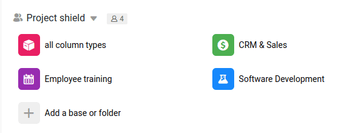

Cada uno de los iconos cuadrados de su página de inicio representa una **Base**. Se trata de una base de datos, comparable a un libro de trabajo de una hoja de cálculo convencional, y puede contener varias **tablas** sobre distintos temas.

Una Base representa una **unidad** autónoma en SeaTable. Por lo tanto, debe contener toda la información que necesita para un proyecto o proceso específico.

Por ejemplo, la base para su canal de ventas puede contener tablas separadas para clientes potenciales, empresas y oportunidades de negocio. Del mismo modo, puedes utilizar una base para planificar una boda y crear tablas independientes para los posibles lugares de celebración, los asistentes y las listas de tareas pendientes.

## Crear una nueva base

SeaTable ofrece varias maneras de crear una nueva base. Si es nuevo en SeaTable, le recomendamos que comience con una **plantilla** para que pueda ver cómo se construye normalmente una Base. Puede elegir una plantilla existente adaptada a su caso de uso de nuestra galería de plantillas y luego simplemente adaptarla a sus propias necesidades.

Si estás familiarizado con la creación de tus propias tablas, columnas y vistas, puedes empezar con una base vacía.

- [Creación de una base mediante una plantilla](https://seatable.io/es/docs/bases-verwalten/anlegen-einer-base-mithilfe-einer-vorlage/)
- [Crear una nueva base](https://seatable.io/es/docs/bases-verwalten/eine-neue-base-erstellen/)
- [Importar archivos de Excel a SeaTable]()
- [Duplicar una base existente](https://seatable.io/es/docs/bases-verwalten/duplizieren-einer-bestehenden-base/)

## Gestionar las bases

Una vez que hayas dominado los primeros pasos y hayas creado tus primeras bases, podrás descubrir toda una serie de funciones adicionales en la página de inicio y en tus bases. Todo lo que necesitas saber sobre la gestión de tus bases lo encontrarás en el capítulo [Bases]().

## Tablas y vistas en una base

La tabla es el nivel más importante en el que puede organizar sus datos en SeaTable, comparable a una hoja de cálculo en una hoja de cálculo. Básicamente, **las tablas** son el siguiente nivel por debajo de [las bases]() en la estructura organizativa de SeaTable.

Dado que SeaTable es un **software de base de datos relacional**, puede vincular la información de diferentes tablas de una base mediante [enlaces](), [automatizaciones](https://seatable.io/es/docs/beispiel-automationen/eintraege-in-andere-tabellen-per-automation-hinzufuegen/) y otras funciones.

Una tabla consta de [filas]() en SeaTable definen qué **tipos de datos** se pueden introducir en una **columna**.

Cada vez que visualizas tus datos en una tabla, lo haces a través de una [vista](). Las vistas te ofrecen un sinfín de opciones para mostrar los datos de tus tablas de forma diferente: filtrarlos, ordenarlos, agruparlos, ocultarlos, etc.
