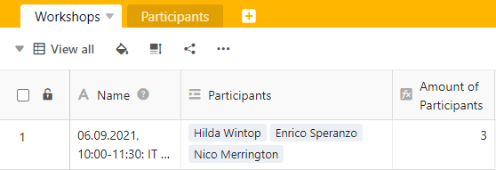

Die Countlinks-Formel zählt die Anzahl der verknüpften Einträge des Spaltentyps **Verknüpfung zu anderen Einträgen** in der jeweiligen Zeile.



Sie können nur dann eine Spalte mit der Countlinks-Formel anlegen, wenn Sie zwei Tabellen miteinander verknüpft haben. Lesen Sie [hier, wie Sie eine solche Verknüpfung anlegen]().



## Anwendungsbereich der Countlinks-Formel

Die **Countlinks-Formel** sollte immer dann zur Anwendung kommen, wenn Sie als Querverweis die **Anzahl von Einträgen** einer anderen Tabelle anzeigen möchten.

Beispielsweise können Sie so bei einer Workshop-Planung die Anzahl angemeldeter Teilnehmer aus einer separaten Tabelle abbilden. Die [Verknüpfungsspalte]() würde somit die Namen aller Teilnehmer festhalten.

Die Verwendung der Countlinks-Formel ergibt nur Sinn, wenn Sie die Option **Verknüpfung zu mehreren Zeilen erlauben** bei der Erstellung einer Spalte des Typs **Verknüpfung zu anderen Einträgen** aktivieren. Wäre die Option ausgeschaltet, würde im Feld der Countlinks-Formel immer eine Eins stehen.

## Erstellen einer Countlinks-Formel

1. Erstellen Sie eine neue Spalte des Typs **Formel für Verknüpfungen**.
2. Geben Sie der Spalte einen passenden **Namen**.
3. Legen Sie als Formel die Option **Countlinks** fest.
4. Wählen Sie nun im Feld **Verknüpfungsspalte in dieser Tabelle auswählen** die Verknüpfungsspalte aus, deren Einträge Sie zählen möchten.
5. Klicken Sie auf **Abschicken**.
