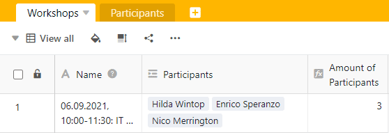

A fórmula Countlinks conta o número de entradas ligadas do tipo de coluna **Ligação a outras entradas** na respectiva linha.



Só pode criar uma coluna com a fórmula Countlinks se tiver ligado duas tabelas. Leia [aqui como criar uma tal ligação]().



## Âmbito da Fórmula Countlinks

A **fórmula Countlinks** deve ser sempre utilizada quando se pretende exibir o **número de entradas de** outra tabela como uma referência cruzada.

Por exemplo, ao planear um workshop, é possível exibir o número de participantes registados a partir de uma tabela separada. A [coluna de ligação]() registaria assim os nomes de todos os participantes.

A utilização da fórmula Countlinks só faz sentido se activar a opção **Allow link to multiple lines** quando se cria uma coluna do tipo Link **to other entries**. Se a opção fosse desligada, haveria sempre uma no campo da fórmula Countlinks.

## Criação de uma Fórmula Countlinks

1. Criar uma nova coluna do tipo **Fórmula para links**.
2. Dar à coluna um **nome** adequado.
3. Defina a opção **Countlinks** como a fórmula.
4. Agora seleccione a **coluna de ligação** cujas entradas deseja contar na coluna **Seleccionar** ligação **neste** campo da **tabela**.
5. Clique em **Submeter**.
