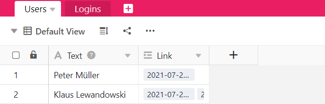

Die **Findmax-Formel** sucht unter den Einträgen der verknüpften Spalte den **Maximalwert** und gibt diesen wieder. Dies ist nützlich, wenn es in der verknüpften Tabelle **mehrere Einträge** gibt, die sich auf denselben Datensatz (z. B. einer Person) in einer anderen Tabelle beziehen.

Die Findmax-Formel funktioniert nur mit **Zahlenwerten**, weshalb der Inhalt der verknüpften Spalte auch aus Zahlenwerten bestehen muss. Zudem ergibt die Verwendung der Findmax-Formel nur Sinn, wenn der Regler **Verknüpfung zu mehreren Zeilen erlauben** bei der Erstellung der Spalte **Verknüpfung zu anderen Einträgen** aktiviert ist. Wäre die Option aus, würde bei der Findmax-Formel immer die gleiche Zahl stehen wie in der verknüpften Spalte.

## Wofür Sie die Findmax-Formel brauchen

Die **Findmax-Funktion** sollte zum Einsatz kommen, wenn Sie **Querverweise** zu numerischen Werten herstellen möchten, die in verschiedenen Tabellen gespeichert sind. Nehmen wir an, Sie verwenden SeaTable zur Sammlung der **Arbeitszeiten** Ihrer Mitarbeiter, wobei in einer Tabelle die Mitarbeiter und in einer anderen Tabelle die tägliche Aktivität gespeichert sind. Jeden Mitarbeiter-Datensatz können Sie dann mit den eingetragenen Arbeitszeiten verknüpfen.

Um festzustellen, wann sich ein Mitarbeiter zuletzt eingeloggt hat, können Sie mithilfe der **Findmax-Formel** den **größten Wert** – in diesem Fall den letzten Zeitpunkt – aus den gesamten Login-Zeiten in einer Spalte darstellen.

Die Findmax-Formel können Sie bei allen numerischen Werten zur Darstellung des **Maximalwerts** verwenden.

## So verwenden Sie die Findmax-Formel

### Eine Tabellenverknüpfung hinzufügen

Informieren Sie sich im Artikel [Wie man Tabellen in SeaTable miteinander verknüpft]() nach, wie Sie eine Spalte des Typs **Verknüpfung zu anderen Einträgen** erstellen. Dies ist eine Grundvoraussetzung, um die Findmax-Formel verwenden zu können.

### Eine Spalte mit Findmax-Formel hinzufügen

1. Erstellen Sie eine neue Spalte des Typs **Formel für Verknüpfungen**.
2. Legen Sie als Formel die Option **Findmax** fest.
3. Wählen Sie die zuvor erstellte Spalte des Typs **Verknüpfung zu anderen Einträgen** in dieser Tabelle aus.
4. Legen Sie nun in dem Feld **Nachschlagespalte in der verknüpften Tabelle "..." auswählen** die Spalte aus der anderen Tabelle fest, die Sie mit der hiesigen Spalte verknüpfen möchten.
5. Klicken Sie auf **Abschicken**.


